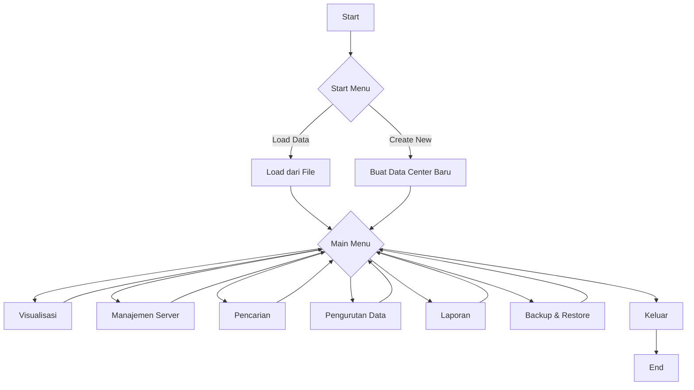
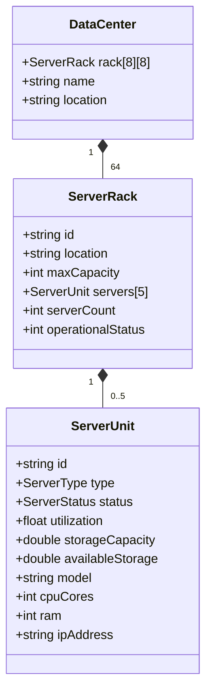

# 🏢 Data Center Management System (DCMS)

<div align="center">


*Sistem Manajemen Data Center Komprehensif dalam C++*

Project Akhir Praktikum Algo Lanjut IF-I

UPN "Veteran" Yogyakarta

**Created by**

Jauza Ilham Mahardhika Putra (123240174)

Prajna Satria Aji Dharma (123240164)

**Important Files To Read**

Structure.md

Fungsi.txt

VersionHistory.md

[🚀 Fitur Utama](#-fitur-utama) • [📖 Dokumentasi](#-struktur-sistem) • [💻 Implementasi Kode](#-implementasi-kode) • [🧪 Demo](#-demo-visualisasi)

</div>

---

## 📋 Daftar Isi

- [🎯 Tentang Proyek](#-tentang-proyek)
- [✨ Fitur Utama](#-fitur-utama)
- [🏗️ Struktur Sistem](#️-struktur-sistem)
- [💻 Implementasi Kode](#-implementasi-kode)
- [🔧 Fungsi-Fungsi Utama](#-fungsi-fungsi-utama)
- [🧪 Demo Visualisasi](#-demo-visualisasi)
- [📊 Algoritma yang Digunakan](#-algoritma-yang-digunakan)
- [🎓 Materi Pembelajaran](#-materi-pembelajaran)
- [📜 Lisensi](#-lisensi)

---

## 🎯 Tentang Proyek

**Data Center Management System (DCMS)** adalah aplikasi berbasis C++ yang dirancang untuk mengelola infrastruktur server dalam pusat data. Sistem ini mengimplementasikan berbagai konsep pemrograman lanjut dalam satu aplikasi terintegrasi.

### 📈 Spesifikasi Teknis
- **Bahasa**: C++ (100%)
- **Layout**: Grid 8x8 dengan sistem walkway
- **Kapasitas**: Maksimal 5 server per rack
- **Storage**: File-based persistence (.txt)
- **Last Update**: 2025-06-02 18:26:29 UTC
- **Repository Owner**: dragonsterm

---

## ✨ Fitur Utama

<div align="center">
<table>
<tr>
<td align="center" width="33%">

### 🗺️ Visualisasi Data Center
Tampilan layout interaktif dengan grid 8x8 dan sistem walkway yang realistis

</td>
<td align="center" width="33%">

### 🔧 Manajemen Server 
Operasi CRUD lengkap dengan validasi input dan interface yang user-friendly

</td>
<td align="center" width="33%">

### 🔍 Searching
Binary Search untuk pencarian berdasarkan ID dan Available Storage

</td>
</tr>
<tr>
<td align="center" width="33%">

### 📊 Sorting Data
Quick Sort dan Insertion Sort dengan multiple criteria

</td>
<td align="center" width="33%">

### 📋 Laporan Otomatis
Generate laporan komprehensif dalam format file terstruktur

</td>
<td align="center" width="33%">

### 💾 Backup & Restore
Sistem penyimpanan data yang aman dengan multiple options

</td>
</tr>
</table>
</div>

---

## 🏗️ Struktur Sistem

### 📦 Data Structures

#### `ServerUnit` - Unit Server Individual
```cpp
struct ServerUnit {
    string id;               // ID unik server
    ServerType type;         // Tipe: Web, Database, Application, File
    ServerStatus status;     // Status: Online, Offline, Maintenance
    float utilization;       // Utilisasi CPU (0-100%)
    double stroageCapacity;  // Kapasitas total storage (GB)
    double availableStorage; // Storage tersedia (GB)
    string model;            // Model server
    int cpuCores;            // Jumlah core CPU
    int ram;                 // RAM dalam GB
    string ipAddress;        // Alamat IP
};
```

#### `ServerRack` - Rack Server
```cpp
struct ServerRack {
    string id;               // ID rack (e.g., "R1-C2")
    string location;         // Lokasi (e.g., "Zone 1")
    int maxCapacity;         // Kapasitas maksimum (default: 5)
    ServerUnit servers[5];   // Array server
    int serverCount;         // Jumlah server saat ini
    int operationalStatus;   // Status operasional rack
};
```

#### `DataCenter` - Struktur Utama
```cpp
struct DataCenter {
    static const int Row = 8;     // Jumlah baris
    static const int Colum = 8;   // Jumlah kolom
    ServerRack rack[Row][Colum];  // Grid rack
    string name;                  // Nama data center
    string location;              // Lokasi data center
};
```

### 🔄 Diagram Alir Sistem



---

## 💻 Implementasi Kode

<details>
<summary><h3>💡 Struct & Enum Dasar</h3></summary>

#### Enum untuk Status dan Tipe Server
```cpp
enum ServerStatus
{
    Offline,
    Online,
    Maintanance,
    UnKnown
};

enum ServerType
{
    Web,
    Database,
    Application,
    File,
    UnCategorized
};
```

#### Constructor ServerUnit
```cpp
// Constructor untuk nilai default
ServerUnit(string id = "", ServerType type = UnCategorized, ServerStatus status = Offline) : 
    id(id),
    type(type),
    status(status),
    utilization(0.0),
    stroageCapacity(100.0),
    availableStorage(100.0),
    model("Generic Server Device"),
    cpuCores(4),
    ram(16),
    ipAddress("1.0.0.1") {}
```

#### Constructor ServerRack
```cpp
// Constructor untuk nilai default
ServerRack() : 
    id(""),
    location(""),
    maxCapacity(5),
    serverCount(0),
    operationalStatus(true) {}
```

#### Constructor DataCenter
```cpp
// Constructor untuk nilai default
DataCenter() : 
    name("Default Data Center"),
    location("Unrecognized Location")
{
    for (int r = 0; r < Row; r++)
    {
        for (int c = 0; c < Colum; c++)
        {
            rack[r][c].id = "R" + to_string(r + 1) + "-C" + to_string(c + 1);
            rack[r][c].location = "Zone " + to_string((r / 2) + 1);
        }
    }
}
```

</details>

<details>
<summary><h3>🚀 Fungsi Main dan Inisialisasi</h3></summary>

#### Fungsi Main
```cpp
int main()
{
    startMenu();
    mainMenu();
    return 0;
}
```
> **Penjelasan**: Titik masuk utama program. Memanggil startMenu() untuk inisialisasi awal dan kemudian mainMenu() untuk interaksi pengguna utama.

#### Fungsi getCurrentDateTime()
```cpp
string getCurrentDateTime()
{
    time_t now = time(0);
    tm *localTime = localtime(&now);

    char temp[80];
    strftime(temp, 80, "%d/%m/%Y %H:%M:%S", localTime);
    return string(temp);
}
```
> **Penjelasan**: Mengambil waktu saat ini dari sistem dan memformatnya menjadi string dengan format tanggal/bulan/tahun jam:menit:detik.

#### Fungsi startMenu() (Full Implementation)
```cpp
void startMenu()
{
    int choice;
    bool validChoice = false;
    while(!validChoice)
    {
        system("cls");
        cout << "===== DATA CENTER MANAGEMENT SYSTEM =====" << endl;
        cout << "=====  DCMS V 1.0 (released) #2025  =====" << endl;
        cout << "[Current Date & Time: " << getCurrentDateTime() << "]" << endl << endl;
        cout << "+---------------------------------------+" << endl;
        cout << "|             START MENU                |" << endl;
        cout << "+---------------------------------------+" << endl;
        cout << "|  1. Load Data dari File Existing      |" << endl;
        cout << "|  2. Buat Data Center Baru             |" << endl;
        cout << "+---------------------------------------+" << endl;
        
        cout << "\nPilih opsi [1-2]: ";
        cin >> choice;
        if (cin.fail())
        {
            cin.clear();
            cin.ignore(1000, '\n');
            cout << "\nInput tidak valid. Silakan coba lagi." << endl;
            continue;
        }
        switch (choice)
        {
        case 1:
            {
                string fileName;
                cout << "Masukkan nama file (tipe file .txt): ";
                cin.ignore();
                getline(cin, fileName);
                ifstream checkFile(fileName);
                if (checkFile.good())
                {
                    checkFile.close();
                    loadDataFromFile(fileName);
                    cout << "\nData berhasil dimuat dari file: " << fileName << endl;
                    cout << "\n\nTekan Enter untuk melanjutkan ke menu utama...";
                    cin.get();
                    validChoice = true;
                } else
                {
                    cout << "\nFile tidak ditemukan atau tidak valid. Silakan coba lagi." << endl;
                    cout << "\nTekan Enter untuk mencoba lagi...";
                    cin.ignore();
                }
            }
            break;
        case 2:
            createNewDataCenter();
            validChoice = true;
            break;
        default:
            cout << "\nPilihan tidak valid. Silakan coba lagi." << endl;
            cout << "\nTekan Enter untuk melanjutkan...";
            cin.ignore();
            cin.get();
            break;
        }
    }
}
```
> **Penjelasan**: Menampilkan menu awal dengan opsi untuk memuat data yang ada atau membuat data center baru. Menggunakan loop untuk validasi input dan memberikan umpan balik yang sesuai untuk setiap aksi pengguna.

#### Fungsi mainMenu() (Full Implementation)
```cpp
void mainMenu()
{
    int choice;
    bool exit = false;

    do
    {
        system("cls");
        // Diplay Header
        cout << "===== DATA CENTER MANAGEMENT SYSTEM =====" << endl;
        cout << "=====  DCMS V 1.0 (released) #2025  =====" << endl;
        cout << "[Current Date & Time: " << getCurrentDateTime() << "]" << endl
             << endl;

        // Dispay Menu opsi
        cout << "+---------------------------------------+" << endl;
        cout << "|          MENU UTAMA                   |" << endl;
        cout << "+---------------------------------------+" << endl;
        cout << "|  1. Visualisasi Data Center           |" << endl;
        cout << "|  2. Manajemen Server                  |" << endl;
        cout << "|  3. Pencarian                         |" << endl;
        cout << "|  4. Pengurutan Data                   |" << endl;
        cout << "|  5. Laporan                           |" << endl;
        cout << "|  6. Save, Backup & Restore Data       |" << endl;
        cout << "|  7. Keluar                            |" << endl;
        cout << "+---------------------------------------+\n\n"
             << endl;

        // Perhitungan System Status
        int activeServer = 0;
        int totalServer = 0;
        double totalStorage = 0.0;
        string countServerId[1000];
        int countServerIdSize = 0;

        for (int r = 0; r < DataCenter::Row; r++)
        {
            for (int c = 0; c < DataCenter::Colum; c++)
            {
                if (r == 2 || r == 5 || c == 2 || c == 5) continue;
                totalServer += dataCenter.rack[r][c].serverCount;
                for (int s = 0; s < dataCenter.rack[r][c].serverCount; s++)
                {
                    ServerUnit &server = dataCenter.rack[r][c].servers[s];
                    if (server.status == Online)
                    {
                        // checker untuk memastikan server tidak terhitung lebih dari sekali
                        bool countCheck = false;
                        for (int i = 0; i < countServerIdSize; i++)
                        {
                            if (countServerId[i] == server.id)
                            {
                                countCheck = true;
                                break;
                            }
                        }
                        if (!countCheck)
                        {
                            activeServer++;
                            totalStorage += server.availableStorage;
                            countServerId[countServerIdSize++] = server.id;
                            countServerIdSize++;
                        }
                    }
                }
            }
        }

        // Dispay System Status
        cout << "System Status: \n";
        cout << "- Servers Aktif: " << activeServer << "/" << totalServer << "\n";
        cout << "- Storage Tersedia: " << totalStorage << "GB \n\n";

        // User input
        cout << "Pilih menu [1-7]: ";
        cin >> choice;

        // Validasi Input
        if (cin.fail())
        {
            cin.clear();
            cin.ignore(1000, '\n');
            cout << "Input tidak valid. Silakan coba lagi." << endl;
            continue;
        }

        if (choice == 7)
        {
            exit = true;
            cout << "Terima kasih telah menggunakan Data Center Management System." << endl;
        }
        else
        {
            processChoice(choice);
        }
    } while (!exit);
}
```
> **Penjelasan**: Menu utama aplikasi yang menampilkan status sistem dan opsi menu. Menghitung jumlah server aktif dan total storage yang tersedia secara real-time untuk menampilkan status sistem. Memproses pilihan pengguna melalui fungsi processChoice().

#### Fungsi processChoice() (Full Implementation)
```cpp
void processChoice(int choice)
{
    switch (choice)
    {
    case 1:
        displayDataCenterMap();
        break;
    case 2:
        manageServers();
        break;
    case 3:
        search();
        break;
    case 4:
        sortData();
        break;
    case 5:
        generateReports();
        break;
    case 6:
        backupAndRestore();
        break;
    default:
        cout << "Pilihan tidak valid. Tekan Enter untuk melanjutkan...";
        cin.ignore();
        cin.get();
        break;
    }
}
```
> **Penjelasan**: Memproses pilihan menu utama pengguna dan memanggil fungsi yang sesuai berdasarkan pilihan tersebut.

</details>

<details>
<summary><h3>🗃️ Operasi File</h3></summary>

#### Fungsi createNewDataCenter() (Full Implementation)
```cpp
void createNewDataCenter()
{
    int choice;
    bool validChoice = false;

    while (!validChoice)
    {
        system("cls");
        cout << "=== Buat Data Center Baru ===" << endl;
        cout << "1. Gunakan Pengaturan Default (sample data)" << endl;
        cout << "2. Input Manual (Zero Data)" << endl;
        cout << "Pilih opsi [1-2]: ";
        cin >> choice;
        if (cin.fail())
        {
            cin.clear();
            cin.ignore(1000, '\n');
            cout << "\nInput tidak valid. Silakan coba lagi." << endl;
            continue;
        }
        switch (choice)
        {
        case 1:
            {
                dataCenter.name = "Default Data Center";
                dataCenter.location = "Unrecognized Location";

                for (int r = 0; r < DataCenter::Row; r++)
                {
                    for (int c = 0; c < DataCenter::Colum; c++)
                    {
                        dataCenter.rack[r][c].id = "R" + to_string(r + 1) + "-C" + to_string(c + 1);
                        dataCenter.rack[r][c].location = "Zone " + to_string((r / 2) + 1);
                        dataCenter.rack[r][c].serverCount = 0; 
                    }
                }
                createSampleDataFile("DataCenterData.txt");
                cout << "\nData Center default berhasil dibuat dengan sample data!" << endl;
                cout << "File tersimpan sebagai: DataCenterData.txt" << endl;
                validChoice = true;
            }
            break;
        case 2:
            {
                string fileName;
                string dcName;
                string dcLocation;

                cin.ignore();
                cout << "Masukkan nama file (hanya nama tanpa .txt): ";
                getline(cin, fileName);
                fileName += ".txt";
                cout << "Masukkan nama Data Center: ";
                getline(cin, dcName);
                cout << "Masukkan lokasi Data Center: ";
                getline(cin, dcLocation);

                dataCenter.name = dcName;
                dataCenter.location = dcLocation;
                for (int r = 0; r < DataCenter::Row; r++) {
                    for (int c = 0; c < DataCenter::Colum; c++) {
                        dataCenter.rack[r][c].id = "R" + to_string(r + 1) + "-C" + to_string(c + 1);
                        dataCenter.rack[r][c].location = "Zone " + to_string((r / 2) + 1);
                        dataCenter.rack[r][c].serverCount = 0;
                    }
                }
                createDataFile(fileName);
                cout << "\n\nData Center baru berhasil dibuat!" << endl;
                cout << "File tersimpan sebagai: " << fileName << endl;
                validChoice = true;
            }
            break;
        default:
            cout << "\nPilihan tidak valid. Silakan coba lagi." << endl;
            cout << "\nTekan Enter untuk melanjutkan..." << endl;
            cin.ignore();
            cin.get();
            break;
        }
    }
    cout << "\nTekan Enter untuk melanjutkan ke menu utama...";
    cin.ignore();
    cin.get();
}
```
> **Penjelasan**: Membuat data center baru dengan dua opsi: pengaturan default (dengan sample data) atau input manual (zero data). Memungkinkan pengguna untuk menetapkan nama dan lokasi data center, serta menyimpan konfigurasi ke file.

#### Fungsi saveDataToFile() (Full Implementation)
```cpp
void saveDataToFile(string fileName)
{
    ofstream file(fileName);
    if (file.is_open()) 
    {
        // menulis info data center
        file << "DATA_CENTER_INFO" << endl;
        file << dataCenter.name << endl;
        file << dataCenter.location << endl;
        file << "END_DATA_CENTER_INFO" << endl;

        // menulis rack dan server data
        file << "RACK_DATA" << endl;
        for (int r = 0; r < DataCenter::Row; r++) 
        {
            for (int c = 0; c < DataCenter::Colum; c++) 
            {
                file << "RACK " << r << " " << c << endl;
                file << dataCenter.rack[r][c].id << endl;
                file << dataCenter.rack[r][c].location << endl;
                file << dataCenter.rack[r][c].maxCapacity << endl;
                file << dataCenter.rack[r][c].operationalStatus << endl;
                file << dataCenter.rack[r][c].serverCount << endl;
                
                // menulis data server untuk rack
                for (int s = 0; s < dataCenter.rack[r][c].serverCount; s++) 
                {
                    ServerUnit& server = dataCenter.rack[r][c].servers[s];
                    file << "SERVER" << endl;
                    file << server.id << endl;
                    file << (int)server.type << endl;
                    file << (int)server.status << endl;
                    file << server.utilization << endl;
                    file << server.stroageCapacity << endl;
                    file << server.availableStorage << endl;
                    file << server.model << endl;
                    file << server.cpuCores << endl;
                    file << server.ram << endl;
                    file << server.ipAddress << endl;
                    file << "END_SERVER" << endl;
                }
                file << "END_RACK" << endl;
            }
        }
        file << "END_RACK_DATA" << endl;
        
        file.close();
        cout << "Data berhasil disimpan ke file: " << fileName << endl;
    } else 
    {
        cout << "Error: Tidak dapat membuka file untuk penyimpanan" << endl;
    }
}
```
> **Penjelasan**: Menyimpan seluruh struktur data center ke file teks dengan format terstruktur. Menulis informasi data center, rack, dan setiap server beserta detailnya.

#### Fungsi loadDataFromFile() (Full Implementation)
```cpp
void loadDataFromFile(string fileName)
{
    ifstream file(fileName);
    if (file.is_open())
    {
        string line;

        // mambaca info data center
        while (getline(file, line))
        {
            if (line == "DATA_CENTER_INFO")
            {
                getline(file, dataCenter.name);
                getline(file, dataCenter.location);
                getline(file, line);
                break;
            }
        }

        // membaca data untuk Rack
        while (getline(file, line))
        {
            if (line == "RACK_DATA")
            {
                while (getline(file, line))
                {
                    if (line == "END_RACK_DATA") break;
                    if (line.substr(0, 4) == "RACK")
                    {
                        int r;
                        int c;
                        sscanf(line.c_str(), "RACK %d %d", &r, &c);
                        getline(file,dataCenter.rack[r][c].id);
                        getline(file, dataCenter.rack[r][c].location);

                        string temp;
                        getline(file, temp);
                        dataCenter.rack[r][c].maxCapacity = stoi(temp);
                        getline(file, temp);
                        dataCenter.rack[r][c].operationalStatus = stoi(temp);
                        getline(file, temp);
                        int serverCount = stoi(temp);
                        dataCenter.rack[r][c].serverCount = serverCount;

                        // Membaca server untuk Rack
                        for (int s = 0; s < serverCount; s++) 
                        {
                            getline(file, line); // SERVER
                            if (line == "SERVER") {
                                ServerUnit& server = dataCenter.rack[r][c].servers[s];
                                
                                getline(file, server.id);
                                
                                getline(file, temp);
                                server.type = (ServerType)stoi(temp);
                                
                                getline(file, temp);
                                server.status = (ServerStatus)stoi(temp);
                                
                                getline(file, temp);
                                server.utilization = stof(temp);
                                
                                getline(file, temp);
                                server.stroageCapacity = stod(temp);
                                
                                getline(file, temp);
                                server.availableStorage = stod(temp);
                                
                                getline(file, server.model);
                                
                                getline(file, temp);
                                server.cpuCores = stoi(temp);
                                
                                getline(file, temp);
                                server.ram = stoi(temp);
                                
                                getline(file, server.ipAddress);
                                
                                getline(file, line);
                            }
                        }
                        getline(file, line);
                    }
                }
                break;
            }
        }
        file.close();
    } else
    {
        cout << "Error: Tidak dapat membuka file: " << fileName << endl;
    }
}
```
> **Penjelasan**: Membaca data dari file teks dan mengisi struktur data center. Memproses file baris demi baris untuk mendapatkan informasi data center, rack, dan server.

#### Fungsi createDataFile() (Full Implementation)
```cpp
void createDataFile(string fileName)
{
    ofstream file (fileName);
    if (file.is_open())
    {
        file << "DATA_CENTER_INFO" << endl;
        file << dataCenter.name << endl;
        file << dataCenter.location << endl;
        file << "END_DATA_CENTER_INFO" << endl;
        file << "RACK_DATA" << endl;
        for (int r = 0; r < DataCenter::Row; r++) 
        {
            for (int c = 0; c < DataCenter::Colum; c++) 
            {
                file << "RACK " << r << " " << c << endl;
                file << dataCenter.rack[r][c].id << endl;
                file << dataCenter.rack[r][c].location << endl;
                file << dataCenter.rack[r][c].maxCapacity << endl;
                file << dataCenter.rack[r][c].operationalStatus << endl;
                file << "0" << endl;
                file << "END_RACK" << endl;
            }
        }
        file << "END_RACK_DATA" << endl;
        
        file.close();
    } else 
    {
        cout << "\nError: Tidak dapat membuat file " << endl;
    }
}
```
> **Penjelasan**: Membuat file data baru untuk data center kosong. Menulis informasi dasar data center dan rack tanpa server.

#### Fungsi createSampleDataFile() (Full Implementation)
```cpp
void createSampleDataFile(string fileName)
{
     // Membuat 10 unique server dengan ID unik
    ServerUnit server1("WEB-001", Web, Online);
    ServerUnit server2("DB-001", Database, Online);
    ServerUnit server3("APP-001", Application, Online);
    ServerUnit server4("FILE-001", File, Online);
    ServerUnit server5("WEB-002", Web, Online);
    ServerUnit server6("DB-002", Database, Online);
    ServerUnit server7("WEB-003", Web, Online);

    // 2 Server di Rack 1,1 (koordinat 0,0)
    addServer(dataCenter.rack[0][0], server1);
    addServer(dataCenter.rack[0][0], server2);

    // 1 Server di Rack 2,1 (koordinat 1,0)
    addServer(dataCenter.rack[1][0], server3);

    // 1 Server di Rack 2,3 (koordinat 1,3)
    addServer(dataCenter.rack[1][3], server4);

    // 1 Server di Rack 4,4 (koordinat 3,3)
    addServer(dataCenter.rack[3][3], server5);

    // 1 Server di Rack 7,1 (koordinat 6,0)
    addServer(dataCenter.rack[6][0], server6);

    // 1 Server di Rack 7,4 (koordinat 6,3)
    addServer(dataCenter.rack[6][3], server7);

    // Static data custom server tidak pakai default constructor bisa add lagi
    ServerUnit customServer1;
    customServer1.id = "WEB-004";
    customServer1.type = Web;  
    customServer1.status = Online;
    customServer1.utilization = 75.5;
    customServer1.stroageCapacity = 2000.0;
    customServer1.availableStorage = 1000.0;
    customServer1.model = "Skibidi T01LET";
    customServer1.cpuCores = 24;
    customServer1.ram = 128;
    customServer1.ipAddress = "192.168.1.100";

    addServer(dataCenter.rack[0][3], customServer1); // {1,4} (koordinat 0,3)
    saveDataToFile(fileName);
}
```
> **Penjelasan**: Membuat file data dengan sampel server untuk demonstrasi. Membuat 8 server dengan berbagai tipe dan konfigurasi, dan menempatkannya di rack berbeda dalam data center.

</details>

<details>
<summary><h3>⚙️ Fungsi Inisialisasi Dasar</h3></summary>

#### Fungsi addServer() (Full Implementation)
```cpp
bool addServer(ServerRack& rack, const ServerUnit& server)
{
    if (rack.serverCount < 5)
    {
        rack.servers[rack.serverCount] = server; // Menambahkan server ke dalam array
        rack.serverCount++;
        return true;
    }
    return false; // rack penuh
}
```
> **Penjelasan**: Fungsi logika dasar untuk menambahkan server ke rack. Memeriksa apakah rack memiliki kapasitas tersedia, menambahkan server ke array, dan memperbarui counter.

#### Fungsi removeServer() (Full Implementation)
```cpp
bool removeServer(ServerRack& rack, int index)
{
    if (index >= 0 && index < rack.serverCount)
    {
        for (int i = index; i < rack.serverCount - 1; i++)
        {
            rack.servers[i] = rack.servers[i + 1];
        }
        rack.serverCount--;
        return true;
    }
    return false;
}
```
> **Penjelasan**: Fungsi logika dasar untuk menghapus server dari rack. Memvalidasi indeks, menggeser server untuk mengisi gap, dan memperbarui counter.

#### Fungsi validateServerPlacement() (Full Implementation)
```cpp
bool validateServerPlacement(int row, int colum)
{
    if (row < 0 || row >= DataCenter::Row || colum < 0 || colum >= DataCenter::Colum)
    {
        return false;
    }

    // Check walkway
    if (row == 2 || row == 5 || colum == 2 || colum == 5)
    {
        return false;
    }
    if (dataCenter.rack[row][colum].serverCount >= dataCenter.rack[row][colum].maxCapacity)
    {
        return false;
    }
    return true;
}
```
> **Penjelasan**: Fungsi validasi untuk penempatan server. Memeriksa apakah koordinat valid (dalam batas grid), bukan walkway, dan rack belum penuh.

</details>

<details>
<summary><h3>🖥️ Manajemen Server</h3></summary>

#### Fungsi manageServers() (Full Implementation)
```cpp
void manageServers()
{
    int choice;
    bool exit = false;
    do
    {
        system("cls");
        cout << "\n===== Manajemen Server =====" << endl;
        cout << "1. Tambah Server Baru" << endl;
        cout << "2. Hapus Server" << endl;
        cout << "3. Update Status Server" << endl;
        cout << "4. Update Utilisasi Server" << endl;
        cout << "5. Kembali ke Menu Utama" << endl;
        cout << "Pilih opsi [1-5]: ";
        cin >> choice;
        cin.get();
        if (cin.fail())
        {
            cin.clear();
            cin.ignore(1000, '\n');
            cout << "Input tidak valid. Silakan coba lagi." << endl;
            cout << "Tekan Enter untuk melanjutkan...";
            cin.get();
            continue;
        }
        switch(choice)
        {
            case 1:
                addNewServer();
                break;
            case 2:
                removeExistingServer();
                break;
            case 3:
                updateServerStatus();
                break;
            case 4:
                updateServerUtilization();
                break;
            case 5:
                exit = true;
                break;
            default:
                cout << "Pilihan tidak valid. Tekan Enter untuk melanjutkan...";
                cin.ignore();
                cin.get();
                break;
        }
    }while(!exit);
}
```
> **Penjelasan**: Menu manajemen server yang menyediakan opsi untuk menambah, menghapus, dan memperbarui server. Memproses pilihan pengguna dan memanggil fungsi yang sesuai.

#### Fungsi displaySimpleDataCenterMap() (Full Implementation)
```cpp
void displaySimpleDataCenterMap()
{
    cout << "\nReferensi Peta Data Center:" << endl;
    cout << "{0} ";
    for (int c = 0; c < DataCenter::Colum; c++)
    {
        if (c == 2 || c == 5)
        {
            cout << "{W}";
        }
        else
        {
            cout << "{" << c + 1 << "}";
        }
    }
    cout << endl;
    
    for (int r = 0; r < DataCenter::Row; r++)
    {
        if (r == 2 || r == 5)
        {
            cout << "{W}" << endl;
            continue;
        }
        cout << "{" << r + 1 << "} ";
        for (int c = 0; c < DataCenter::Colum; c++)
        {
            if (c == 2 || c == 5)
            {
                cout << "   ";
                continue;
            }
            int serverCount = dataCenter.rack[r][c].serverCount;
            if (serverCount > 0)
            {
                cout << "[" << serverCount << "]";
            }
            else
            {
                cout << "[ ]";
            }
        }
        cout << endl;
    }
    cout << "\nKeterangan:" << endl;
    cout << "[ ] = kosong\n";
    cout << "{W} = walkway\n\n";
}
```
> **Penjelasan**: Menampilkan visualisasi sederhana dari peta data center sebagai referensi untuk fungsi manajemen server. Menunjukkan lokasi rack dan jumlah server di setiap rack.

#### Fungsi addNewServer() (Full Implementation)
```cpp
void addNewServer()
{
    system("cls");
    cout << "\n===== Tambah Server Baru =====" << endl;
    displaySimpleDataCenterMap();

    int row;
    int colum;
    bool validLocation = false;
    while (!validLocation)
    {
        cout << "\nMasukkan lokasi untuk server baru:" << endl;
        cout << "Baris [1-" << DataCenter::Row << "]: ";
        cin >> row;
        cout << "Kolom [1-" << DataCenter::Colum << "]: ";
        cin >> colum;

        if (cin.fail())
        {
            cin.clear();
            cin.ignore(1000, '\n');
            cout << "\nInput tidak valid. Silakan coba lagi." << endl;
            continue;
        }
        row--;
        colum--; // konversi agar sesuai array
        if (!validateServerPlacement(row, colum))
        {
            if (row == 2 || row == 5 || colum == 2 || colum == 5)
            {
                cout << "Error: Lokasi tersebut adalah walkway!" << endl;
            }
            else if (dataCenter.rack[row][colum].serverCount >= dataCenter.rack[row][colum].maxCapacity)
            {
                cout << "Error: Rack sudah penuh! (Kapasitas: " << dataCenter.rack[row][colum].maxCapacity << ")" << endl;
            }
            else
            {
                cout << "Error: Koordinat tidak valid!" << endl;
            }
            cout << "\n\nTekan Enter untuk mencoba lagi...";
            cin.ignore();
            cin.get();
            continue;
        }
        validLocation = true;
    }
    ServerRack& selectedRack = dataCenter.rack[row][colum];
    int availableSpace = selectedRack.maxCapacity - selectedRack.serverCount;
    system("cls");
    cout << "\n===== Tambah Server Baru =====" << endl;
    cout << "Rack yang dipilih: " << selectedRack.id << endl;
    cout << "Server saat ini: " << selectedRack.serverCount << "/" << selectedRack.maxCapacity << endl;
    cout << "Ruang tersedia: " << availableSpace << " server" << endl;
    if (availableSpace == 0)
    {
        cout << "\nError: Rack sudah penuh!" << endl;
        cout << "Tekan Enter untuk kembali...";
        cin.ignore();
        cin.get();
        return;
    }
    int serverCount;
    bool validServerCount = false;
    while (!validServerCount)
    {
        cout << "\nBerapa server yang ingin ditambahkan? [1-" << availableSpace << "]: ";
        cin >> serverCount;
        
        if (cin.fail())
        {
            cin.clear();
            cin.ignore(1000, '\n');
            cout << "Input tidak valid. Silakan masukkan angka." << endl;
            continue;
        }
        
        if (serverCount < 1 || serverCount > availableSpace)
        {
            cout << "Jumlah tidak valid. Maksimal " << availableSpace << " server dapat ditambahkan." << endl;
            continue;
        }
        
        validServerCount = true;
    }
    int succefullyAdded = 0;
    bool continueAdding = true;
    for (int i = 0; i < serverCount && continueAdding; i++)
    {
        system("cls");
        cout << "\n===== Tambah Server Baru =====" << endl;
        cout << "Rack: " << selectedRack.id << endl;
        cout << "Progress: Menambahkan server " << (i + 1) << " dari " << serverCount << endl;
        cout << "============================" << endl;
        ServerUnit newServer;
        displayServerInputForm(newServer);
        if (addServer(selectedRack,newServer))
        {
            succefullyAdded++;
            system("cls");
            cout << "\n===== Tambah Server Baru =====" << endl;
            cout << "============================" << endl;
            cout << "| Server berhasil ditambahkan" << endl;
            cout << "| Server ID: " << newServer.id << endl;
            cout << "| Rack: " << selectedRack.id << endl;
            cout << "| Progress: " << succefullyAdded << "/" << serverCount << " server ditambahkan" << endl;
            cout << "============================" << endl;
            if (i < serverCount - 1)
            {
                char continueChoice;
                cout << "\nApakah Anda ingin menambahkan server lagi? (y/n): ";
                cin >> continueChoice;
                if (continueChoice == 'n' || continueChoice == 'N')
                {
                    continueAdding = false;
                    cout << "\nPenambahan server dihentikan oleh user." << endl;
                }
            }
            if (continueAdding && i < serverCount - 1)
            {
                cout << "\nTekan Enter untuk melanjutkan ke server berikutnya...";
                cin.ignore();
                cin.get();
            }
        }
        else 
        {
            cout << "\nError: Gagal menambahkan server!" << endl;
            cout << "Tekan Enter untuk melanjutkan...";
            cin.ignore();
            cin.get();
        }
    }
    system("cls");
    cout << "\n===== Ringkasan Penambahan Server =====" << endl;
    cout << "============================" << endl;
    cout << "| Rack: " << selectedRack.id << endl;
    cout << "| Server berhasil ditambahkan: " << succefullyAdded << "/" << serverCount << endl;
    cout << "| Total server dalam rack: " << selectedRack.serverCount << "/" << selectedRack.maxCapacity << endl;
    cout << "============================" << endl;
    char retryChoice;
    cout << "\nApakah Anda ingin menambah server ke rack lain? (y/n): ";
    cin >> retryChoice;
    if (retryChoice == 'y' || retryChoice == 'Y')
    {
        cout << "\nKembali ke pemilihan rack..." << endl;
        cout << "Tekan Enter untuk melanjutkan...";
        cin.ignore();
        cin.get();
        addNewServer(); // Rekursif
    } else
    {
        cout << "\nKembali ke menu manajemen server..." << endl;
        cout << "Tekan Enter untuk melanjutkan...";
        cin.ignore();
        cin.get();
    }
}
```
> **Penjelasan**: Proses interaktif untuk menambahkan server baru. Memandu pengguna melalui pemilihan lokasi rack, menentukan jumlah server yang akan ditambahkan, dan mengisi informasi untuk setiap server baru.

#### Fungsi displayServerInputForm() (Full Implementation)
```cpp
void displayServerInputForm(ServerUnit& server)
{
    int typeChoice;
    int statusChoice;
    system("cls");
    cout << "\n===== Input Data Server =====" << endl;
    cout << "| Masukkan ID Server: ";
    cin.ignore();
    getline(cin, server.id);
    system("cls");
    cout << "\n===== Input Data Server =====" << endl;
    cout << "| Server ID: " << server.id << endl;
    cout << "| Pilih Tipe Server:" << endl;
    cout << "| 1. Web Server" << endl;
    cout << "| 2. Database Server" << endl;
    cout << "| 3. Application Server" << endl;
    cout << "| 4. File Server" << endl;
    cout << "Pilih [1-4]: ";
    cin >> typeChoice;
    switch (typeChoice)
    {
    case 1:
        server.type = Web;
        break;
    case 2:
        server.type = Database;
        break;
    case 3:
        server.type = Application;
        break;
    case 4:
        server.type = File;
        break;
    default:
        server.type = UnCategorized;
        break;
    }
    system("cls");
    cout << "\n===== Input Data Server =====" << endl;
    cout << "| Server ID: " << server.id << endl;
    cout << "| Tipe: " << (server.type == Web ? "Web" : server.type == Database ? "Database" : server.type == Application ? "Application" : server.type == File ? "File" : "UnCategorized") << endl;
    cout << "| Pilih Status Server:" << endl;
    cout << "| 1. Offline" << endl;
    cout << "| 2. Online" << endl;
    cout << "| 3. Maintenance" << endl;
    cout << "Pilih [1-3]: ";
    cin >> statusChoice;
    switch (statusChoice)
    {
    case 1:
        server.status = Offline;
        break;
    case 2:
        server.status = Online;
        break;
    case 3:
        server.status = Maintanance;
        break;
    default:
        server.status = UnKnown;
        break;
    }
    system("cls");
    cout << "\n===== Input Data Server =====" << endl;
    cout << "| Server ID: " << server.id << endl;
    cout << "| Tipe: " << (server.type == Web ? "Web" : server.type == Database ? "Database" :  server.type == File ? "File" : "UnCategorized") << endl;
    cout << "| Status: " << (server.status == Online ? "Online" : server.status == Offline ? "Offline" : server.status == Maintanance ? "Maintenance" : "Unknown") << endl;
    cout << "============================" << endl;
    cout << "| Masukkan Utilisasi (0-100%): ";
    cin >> server.utilization;
    cout << "| Masukkan Kapasitas Storage (GB): ";
    cin >> server.stroageCapacity;
    cout << "| Masukkan Available Storage (GB): ";
    cin >> server.availableStorage;
    cout << "| Masukkan Model Server: ";
    cin.ignore();
    getline(cin, server.model);
    cout << "| Masukkan Jumlah CPU Cores: ";
    cin >> server.cpuCores;
    cout << "| Masukkan RAM (GB): ";
    cin >> server.ram;
    cout << "| Masukkan IP Address: ";
    cin.ignore();
    getline(cin, server.ipAddress);
}
```
> **Penjelasan**: Form interaktif untuk mengisi semua informasi server baru. Membimbing pengguna melalui setiap langkah proses input dengan validasi dan tampilan yang jelas.

#### Fungsi removeExistingServer() (Full Implementation)
```cpp
void removeExistingServer()
{
    char confirm;
    system("cls");
    cout << "\n===== Hapus Server =====" << endl;
    displaySimpleDataCenterMap();
    int row;
    int colum;
    bool validlocation = false;
    while (!validlocation)
    {
        cout << "\nMasukkan lokasi rack yang berisi server:" << endl;
        cout << "Baris [1-" << DataCenter::Row << "]: ";
        cin >> row;
        cout << "Kolom [1-" << DataCenter::Colum << "]: ";
        cin >> colum;

        if (cin.fail())
        {
            cin.clear();
            cin.ignore(1000, '\n');
            cout << "Input tidak valid. Silakan coba lagi." << endl;
            continue;
        }
        row--;
        colum--;
        if (row < 0 || row >= DataCenter::Row || colum < 0 || colum >= DataCenter::Colum)
        {
            cout << "Error: Koordinat tidak valid!" << endl;
            cout << "Tekan Enter untuk mencoba lagi...";
            cin.ignore();
            cin.get();
            continue;
        }
        if (row == 2 || row == 5 || colum == 2 || colum == 5)
        {
            cout << "Error: Lokasi tersebut adalah walkway!" << endl;
            cout << "Tekan Enter untuk mencoba lagi...";
            cin.ignore();
            cin.get();
            continue;
        }
        if (dataCenter.rack[row][colum].serverCount == 0)
        {
            cout << "Error: Tidak ada server dalam rack ini!" << endl;
            cout << "Tekan Enter untuk mencoba lagi...";
            cin.ignore();
            cin.get();
            continue;
        }
        validlocation = true;
    }
    ServerRack& rack = dataCenter.rack[row][colum];
    system("cls");
    cout << "\n===== Hapus Server =====" << endl;
    cout << "Server dalam Rack " << rack.id << ":" << endl;
    cout << "+-------+------------+--------------+" << endl;
    cout << "| No.   | Server ID  | Status       |" << endl;
    cout << "+-------+------------+--------------+" << endl;
    for (int i = 0; i < rack.serverCount; i++)
    {
        string statusString;
        switch (rack.servers[i].status)
        {
            case Online:
                statusString = "Online";
                break;
            case Offline:
                statusString = "Offline";
                break;
            case Maintanance:
                statusString = "Maintenance";
                break;
            default:
                statusString = "Unknown";
                break;
        }
        cout << "| " << setw(5) << left << i + 1 << " | "
             << setw(10) << left << rack.servers[i].id << " | "
             << setw(12) << left << statusString << " |" << endl;
    }
    cout << "+-------+------------+--------------+" << endl;
    int serverIndex;
    cout << "\nMasukkan nomor server [1-" << rack.serverCount << "]: ";
    cin >> serverIndex;
    if (cin.fail() || serverIndex < 1 || serverIndex > rack.serverCount)
    {
        cout << "Nomor server tidak valid!" << endl;
        cout << "Tekan Enter untuk kembali...";
        cin.ignore();
        cin.get();
        return;
    }
    serverIndex--; //konversi ke array (ya begitu lah :( )
    string serverIdToDelete = rack.servers[serverIndex].id;
    system("cls");
    cout << "\n===== Hapus Server =====" << endl;
    cout << "Apakah Anda yakin ingin menghapus server '" << serverIdToDelete << "'? (y/n): ";
    cin >> confirm;
    if (confirm == 'y' || confirm == 'Y')
    {
        if (removeServer(rack, serverIndex))
        {
            cout << "\nServer '" << serverIdToDelete << "' berhasil dihapus" << endl;
        } else
        {
            cout << "\nGagal menghapus server!" << endl;
        }
    } else
    {
        cout << "\nPenghapusan dibatalkan." << endl;
    }
    cout << "Tekan Enter untuk kembali...";
    cin.ignore();
    cin.get();
}
```
> **Penjelasan**: Proses untuk menghapus server dari rack. Memungkinkan pengguna memilih rack, melihat daftar server di dalamnya, memilih server untuk dihapus, dan mengonfirmasi penghapusan.

#### Fungsi updateServerStatus() (Full Implementation)
```cpp
void updateServerStatus()
{
    int newStatus;
    system("cls");
    cout << "\n===== Update Status Server =====" << endl;
    displaySimpleDataCenterMap();
    int row;
    int colum;
    bool validlocation = false;
    while (!validlocation)
    {
        cout << "\nMasukkan lokasi rack yang berisi server:" << endl;
        cout << "Baris [1-" << DataCenter::Row << "]: ";
        cin >> row;
        cout << "Kolom [1-" << DataCenter::Colum << "]: ";
        cin >> colum;

        if (cin.fail())
        {
            cin.clear();
            cin.ignore(1000, '\n');
            cout << "Input tidak valid. Silakan coba lagi." << endl;
            continue;
        }
        row--;
        colum--;
        if (row < 0 || row >= DataCenter::Row || colum < 0 || colum >= DataCenter::Colum)
        {
            cout << "Error: Koordinat tidak valid!" << endl;
            cout << "Tekan Enter untuk mencoba lagi...";
            cin.ignore();
            cin.get();
            continue;
        }
        if (row == 2 || row == 5 || colum == 2 || colum == 5)
        {
            cout << "Error: Lokasi tersebut adalah walkway!" << endl;
            cout << "Tekan Enter untuk mencoba lagi...";
            cin.ignore();
            cin.get();
            continue;
        }
        if (dataCenter.rack[row][colum].serverCount == 0)
        {
            cout << "Error: Tidak ada server dalam rack ini!" << endl;
            cout << "Tekan Enter untuk mencoba lagi...";
            cin.ignore();
            cin.get();
            continue;
        }
        validlocation = true;
    }
    ServerRack& rack = dataCenter.rack[row][colum];
    system("cls");
    cout << "\n===== Update Status Server =====" << endl;
    cout << "Server dalam Rack " << rack.id << ":" << endl;
    cout << "+-------+------------+--------------+" << endl;
    cout << "| No.   | Server ID  | Status       |" << endl;
    cout << "+-------+------------+--------------+" << endl;
    for (int i = 0; i < rack.serverCount; i++)
    {
        string statusString;
        switch (rack.servers[i].status)
        {
            case Online:
                statusString = "Online";
                break;
            case Offline:
                statusString = "Offline";
                break;
            case Maintanance:
                statusString = "Maintenance";
                break;
            default:
                statusString = "Unknown";
                break;
        }
        cout << "| " << setw(5) << left << i + 1 << " | "
             << setw(10) << left << rack.servers[i].id << " | "
             << setw(12) << left << statusString << " |" << endl;
    }
    cout << "+-------+------------+--------------+" << endl;
    int serverIndex;
    cout << "Masukkan nomor server [1-" << rack.serverCount << "]: ";
    cin >> serverIndex;
    if (cin.fail() || serverIndex < 1 || serverIndex > rack.serverCount)
    {
        cout << "Nomor server tidak valid!" << endl;
        cout << "Tekan Enter untuk kembali...";
        cin.ignore();
        cin.get();
        return;
    }
    serverIndex--;
    ServerUnit& server = rack.servers[serverIndex];
    system("cls");
    cout << "\n===== Update Status Server =====" << endl;
    cout << "| Server yang dipilih: " << server.id << endl;
    cout << "| Status saat ini: ";
    switch (server.status)
    {
        case Online: 
            cout << "Online"; 
            break;
        case Offline: 
            cout << "Offline"; 
            break;
        case Maintanance: 
            cout << "Maintenance"; 
            break;
        default: 
            cout << "Unknown"; 
            break;
    }
    cout << endl;
    cout << "============================" << endl;
    cout << "| Pilih status baru:" << endl;
    cout << "| 1. Offline" << endl;
    cout << "| 2. Online" << endl;
    cout << "| 3. Maintenance" << endl;
    cout << "Pilih [1-3]: ";
    cin >> newStatus;
    system("cls");
    cout << "\n===== Update Status Server =====" << endl;
    switch(newStatus)
    {
        case 1:
            server.status = Offline;
            cout << "\nStatus server berhasil diubah ke Offline!" << endl;
            break;
        case 2:
            server.status = Online;
            cout << "\nStatus server berhasil diubah ke Online!" << endl;
            break;
        case 3:
            server.status = Maintanance;
            cout << "\nStatus server berhasil diubah ke Maintenance!" << endl;
            break;
        default:
            cout << "\nStatus tidak valid!" << endl;
            break;
    }
    cout << "Tekan Enter untuk kembali....";
    cin.ignore();
    cin.get();
}
```
> **Penjelasan**: Proses untuk memperbarui status server. Memungkinkan pengguna memilih rack, melihat daftar server, memilih server, dan mengubah statusnya (Online, Offline, Maintenance).

#### Fungsi updateServerUtilization() (Full Implementation)
```cpp
void updateServerUtilization()
{
    system("cls");
    cout << "\n===== Update Utilisasi Server =====" << endl;
    displaySimpleDataCenterMap();
    int row;
    int colum;
    bool validlocation = false;
    while (!validlocation)
    {
        cout << "\nMasukkan lokasi rack yang berisi server:" << endl;
        cout << "Baris [1-" << DataCenter::Row << "]: ";
        cin >> row;
        cout << "Kolom [1-" << DataCenter::Colum << "]: ";
        cin >> colum;

        if (cin.fail())
        {
            cin.clear();
            cin.ignore(1000, '\n');
            cout << "Input tidak valid. Silakan coba lagi." << endl;
            continue;
        }
        row--;
        colum--;
        if (row < 0 || row >= DataCenter::Row || colum < 0 || colum >= DataCenter::Colum)
        {
            cout << "Error: Koordinat tidak valid!" << endl;
            cout << "Tekan Enter untuk mencoba lagi...";
            cin.ignore();
            cin.get();
            continue;
        }
        if (row == 2 || row == 5 || colum == 2 || colum == 5)
        {
            cout << "Error: Lokasi tersebut adalah walkway!" << endl;
            cout << "Tekan Enter untuk mencoba lagi...";
            cin.ignore();
            cin.get();
            continue;
        }
        if (dataCenter.rack[row][colum].serverCount == 0)
        {
            cout << "Error: Tidak ada server dalam rack ini!" << endl;
            cout << "Tekan Enter untuk mencoba lagi...";
            cin.ignore();
            cin.get();
            continue;
        }
        validlocation = true;
    }
    ServerRack& rack = dataCenter.rack[row][colum];
    system("cls");
    cout << "\n===== Update Utilisasi Server =====" << endl;
    cout << "Server dalam Rack " << rack.id << ":" << endl;
    cout << "+-------+------------+--------------+" << endl;
    cout << "| No.   | Server ID  | Status       |" << endl;
    cout << "+-------+------------+--------------+" << endl;
    for (int i = 0; i < rack.serverCount; i++)
    {
        string statusString;
        switch (rack.servers[i].status)
        {
            case Online:
                statusString = "Online";
                break;
            case Offline:
                statusString = "Offline";
                break;
            case Maintanance:
                statusString = "Maintenance";
                break;
            default:
                statusString = "Unknown";
                break;
        }
        cout << "| " << setw(5) << left << i + 1 << " | "
             << setw(10) << left << rack.servers[i].id << " | "
             << setw(12) << left << statusString << " |" << endl;
    }
    cout << "+-------+------------+--------------+" << endl;
    int serverIndex;
    cout << "Masukkan nomor server [1-" << rack.serverCount << "]: "; 
    cin >> serverIndex;
    if (cin.fail() || serverIndex < 1 || serverIndex > rack.serverCount)
    {
        cout << "Nomor server tidak valid!" << endl;
        cout << "Tekan Enter untuk kembali...";
        cin.ignore();
        cin.get();
        return;
    }
    serverIndex--;
    ServerUnit& server = rack.servers[serverIndex];
    system("cls");
    cout << "\n===== Update Utilisasi Server =====" << endl;
    cout << "| Server yang dipilih: " << server.id << endl;
    cout << "| Utilisasi saat ini: " << server.utilization << "%" << endl;
    float newUtilization;
     cout << "| Masukkan utilisasi baru (0-100%): ";
    cin >> newUtilization;
    cout << "============================" << endl;
    if (newUtilization < 0 || newUtilization > 100)
    {
        cout << "Error: Utilisasi harus antara 0-100%!" << endl;
    }
    else
    {
        server.utilization = newUtilization;
        cout << "\nUtilisasi server berhasil diubah ke " << newUtilization << "%!" << endl;
    }
    cout << "Tekan Enter untuk kembali...";
    cin.ignore();
    cin.get();
}
```
> **Penjelasan**: Proses untuk memperbarui utilisasi server. Memungkinkan pengguna memilih rack, melihat daftar server, memilih server, dan mengubah nilai utilisasinya.

</details>

<details>
<summary><h3>📊 Visualisasi Data Center</h3></summary>

#### Fungsi displayDataCenterMap() (Full Implementation)
```cpp
void displayDataCenterMap()
{
    int choice;
    bool exit = false;

    do
    {
        system("cls");
        cout << "\n=== Visualisasi Data Center ===" << endl;
        cout << "Nama Data Center: [" << dataCenter.name << "]" << endl;
        cout << "Lokasi: [" << dataCenter.location << "]" << endl;

        // Colum Header
        cout << "{0} ";
        for (int c = 0; c < DataCenter::Colum; c++)
        {
            if (c == 2 || c == 5)
            {
                cout << "{W}";
            }
            else
            {
                cout << "{" << c + 1 << "}";
            }
        }
        cout << endl;
        // Data Center Layout
        for (int r = 0; r < DataCenter::Row; r++)
        {
            // Walkway Row
            if (r == 2 || r == 5)
            {
                cout << "{W}" << endl;
                continue;
            }

            // Print nomer Row
            cout << "{" << r + 1 << "} ";

            // Server Rack di dalam setiap Row
            for (int c = 0; c < DataCenter::Colum; c++)
            {
                // Walkway space
                if (c == 2 || c == 5)
                {
                    cout << "   ";
                    continue;
                }

                int serverCount = dataCenter.rack[r][c].serverCount; // Mendapatakan jumlah server di dalam rack

                // Display Rack kosong
                if (serverCount > 0)
                {
                    cout << "[" << serverCount << "]";
                }
                else
                {
                    cout << "[ ]";
                }
            }
            cout << endl;
        }
        // menghitung toal rack dan server
        int totalRackServers = 0;
        int totalServers = 0;
        for (int r = 0; r < DataCenter::Row; r++)
        {
            for (int c = 0; c < DataCenter::Colum; c++)
            {
                int count = dataCenter.rack[r][c].serverCount;
                if (count > 0)
                {
                    totalRackServers++;
                    totalServers += count;
                }
            }
        }
        cout << "\nTotal:\n";
        cout << "- " << totalServers << " server dalam " << totalRackServers << " rack\n";

        // Deskripsi
        cout << "\nKeterangan:\n";
        cout << "[n] = Server Count\n";
        cout << "[ ] = Empty Rack\n";
        cout << "{W} = Walkway/Koridor\n";

        cout << "\n=== Sub Menu Visualisasi ===" << endl;
        cout << "1. Tampilan Server Rack\n";
        cout << "2. Return to Main Menu\n";
        cout << "Pilih menu [1-2]: ";
        cin >> choice;

        if (cin.fail())
        {
            cin.clear();
            cin.ignore(1000, '\n');
            cout << "Input tidak valid. Silakan coba lagi." << endl;
            continue;
        }
        switch (choice)
        {
        case 1:
            displayRackView();
            break;
        case 2:
            exit = true;
            break;
        default:
            cout << "Pilihan tidak valid. Tekan Enter untuk melanjutkan...";
            cin.ignore();
            cin.get();
            break;
        }
    } while (!exit);
}
```
> **Penjelasan**: Menampilkan visualisasi grid data center dengan layout 8x8, termasuk walkway pada baris dan kolom 3 & 6. Menyediakan informasi tentang jumlah server di setiap rack, total server, dan memungkinkan pengguna melihat detail rack spesifik.

#### Fungsi displayRackView() (Full Implementation)
```cpp
void displayRackView()
{
    int row, column;
    bool ValidCoords = false;
    while (!ValidCoords) {
    system("cls");
    cout << "\n===== Tampilan Server Rack =====" << endl;
    cout << "\nReferensi Peta Data Center:" << endl;
    cout << "{0} ";
    for (int c = 0; c < DataCenter::Colum; c++)
    {
        if (c == 2 || c == 5)
        {
            cout << "{W}";
        }
        else
        {
            cout << "{" << c + 1 << "}";
        }
    }
    cout << endl;
    for (int r = 0; r < DataCenter::Row; r++)
    {
        if (r == 2 || r == 5)
        {
            cout << "{W}" << endl;
            continue;
        }
        cout << "{" << r + 1 << "} ";
        for (int c = 0; c < DataCenter::Colum; c++)
        {
            if (c == 2 || c == 5)
            {
                cout << "   ";
                continue;
            }
            int serverCount = dataCenter.rack[r][c].serverCount;
            if (serverCount > 0)
            {
                cout << "[" << serverCount << "]";
            }
            else
            {
                cout << "[ ]";
            }
        }
        cout << endl;
    }
    cout << "\n------------------------------------------\n";
    cout << "\n=== Tampilan Server Rack ===" << endl;
    cout << "Masukkan koordinat Rack (Baris,Kolom):\n";
    cout << "[1-" << DataCenter::Row << "]: ";
    cin >> row;
    cout << "[1-" << DataCenter::Colum << "]: ";
    cin >> column;

    if (cin.fail()) 
    {
        cin.clear();
        cin.ignore(1000, '\n');
        cout << "Input tidak valid. Tekan Enter untuk mencoba lagi...";
        cin.get();
        continue;
    }
    row--;
    column--; // agar sesuai dengan index array

    // Validasi koorinat
    if (row < 0 || row >= DataCenter::Row || column < 0 || column >= DataCenter::Colum)
    {
        cout << "Koordinat tidak valid. Tekan Enter untuk mencoba lagi...";
            cin.ignore();
            cin.get();
            continue;
    }
    // Validasi walkway
    if (row == 2 || row == 5 || column == 2 || column == 5)
    {
        cout << "Koordinat tidak valid. Tekan Enter untuk mencoba lagi...";
            cin.ignore();
            cin.get();
            continue;
    }
    ValidCoords = true; 
    }

    bool exit = false;

    while (!exit) {
    // Ambil informasi rack
    ServerRack &rack = dataCenter.rack[row][column];
    string rackId = rack.id;
    string locataion = rack.location;
    int serverCount = rack.serverCount;

    system("cls");
    cout << "\n===== Detail Rack Server =====" << endl;
    cout << "ID Rack: " << rackId << endl;
    cout << "Lokasi: " << locataion << endl;
    cout << "Kapasitas: " << rack.maxCapacity << " Server" << endl;
    cout << "Status Operasional: " << (rack.operationalStatus ? "Aktif" : "Tidak Aktif") << endl;

    if (serverCount > 0)
    {
        cout << "\n===== Daftar Server dalam Rack =====" << endl;
        cout << "+-------+------------+--------------+-----------+---------------+----------------+" << endl;
        cout << "| No.   | Server ID  | Tipe         | Status    | Utilisasi (%) | Storage (GB)   |" << endl;
        cout << "+-------+------------+--------------+-----------+---------------+----------------+" << endl;

        for (int i = 0; i < serverCount; i++) 
        {
            ServerUnit& server = rack.servers[i];

            //konversi enum ke string
            string typeString;
            switch (server.type)
            {
            case Web:
                typeString = "Web";
                break;
            case Database:
                typeString = "Database";
                break;
            case Application:
                typeString = "Application";
                break;
            case File:
                typeString = "File";
                break;    
            default:
                typeString = "UnCategorized";
                break;
            }

            string statusString;
            switch (server.status)
            {
            case Online:
                statusString = "Online";
                break;
            case Offline:
                statusString = "Offline";
                break;
            case Maintanance:
                statusString = "Maintenance";
                break;
            default:
                statusString = "Unknown";
                break;    
            }

            // Display server details dalam tabel
            string storageInfo = to_string(int(server.availableStorage)) + "/" + to_string(int(server.stroageCapacity));
             cout << "| " << setw(5) << left << i+1 << " | "
                 << setw(10) << left << server.id << " | "
                 << setw(12) << left << typeString << " | "
                 << setw(9) << left << statusString << " | "
                 << setw(13) << left << server.utilization << " | "
                 << setw(14) << left << storageInfo << " |" << endl;
        }
        cout << "+-------+------------+--------------+-----------+---------------+----------------+\n";
        cout << "\n\n=== Sub Menu Detail Rack===\n";
        cout << "1. Detail Server\n";
        cout << "2. Kembali\n";
        cout << "Pilih menu [1-2]: ";
        int choice;
        cin >> choice;
        if (choice == 1)
        {
            displayServerDetails(rack);
            continue;
        }
        else 
        {
            exit = true;
        }
    } else 
    {
        exit = true;
        cout << "Tidak ada server dalam rack ini." << endl;
        cout << "\nTekan Enter untuk kembali...";
        cin.ignore();
        cin.get();
    }
}
}
```
> **Penjelasan**: Memungkinkan pengguna memilih rack spesifik untuk dilihat detailnya. Menampilkan informasi rack dan daftar server dalam format tabel, serta memungkinkan pengguna melihat detail lebih lanjut tentang server tertentu.

#### Fungsi displayServerDetails() (Full Implementation)
```cpp
void displayServerDetails(ServerRack& rack)
{
    int serverIndex;
    system("cls");
    cout << "\n===== Detail Server =====" << endl;
    cout << "\nServer dalam Rack " << rack.id << ":" << endl;
    cout << "+-------+------------+" << endl;
    cout << "| No.   | Server ID  |" << endl;
    cout << "+-------+------------+" << endl;

    for (int i = 0; i < rack.serverCount; i++)
    {
        cout << "| " << setw(5) << left << i + 1 << " | "
             << setw(10) << left << rack.servers[i].id << " |" << endl;
    }
    cout << "+-------+------------+" << endl;
    
    cout << "Masukkan nomor server [1-" << rack.serverCount << "]: ";
    cin >> serverIndex;

    // Validasi input
    if (cin.fail() || serverIndex < 1 || serverIndex > rack.serverCount)
    {
        cin.clear();
        cin.ignore(1000, '\n');
        cout << "Input tidak valid. Tekan Enter untuk kembali...";
        cin.get();
        return;
    }

    serverIndex--; // untuk menyesuaikan dengan index array
    ServerUnit& server = rack.servers[serverIndex]; // ambil server berdasarkan index

    //konversi enum ke string
    string typeString;
    switch (server.type)
    {
        case Web:
        typeString = "Web";
        break;
        case Database:
        typeString = "Database";
        break;
        case Application:
        typeString = "Application";
        break;
        case File:
        typeString = "File";
        break;    
        default:
        typeString = "UnCategorized";
        break;
    }
    string statusString;
    switch (server.status)
    {
        case Online:
        statusString = "Online";
        break;
        case Offline:
        statusString = "Offline";
        break;
        case Maintanance:
        statusString = "Maintenance";
        break;
        default:
        statusString = "Unknown";
        break;    
    }
    system("cls");
    cout << "\n===== Detail Server =====" << endl;
    cout << "Dalam Rack: " << rack.id << " (Server " << serverIndex + 1 << " dari " << rack.serverCount << ")" << endl;
    cout << "\n=== Informasi Umum ===" << endl;
    cout << "| ID Server              : " << server.id << endl;
    cout << "| Model                  : " << server.model << endl;
    cout << "| Tipe                   : " << typeString << endl;
    cout << "| Status                 : " << statusString << endl;
    cout << "| IP Address             : " << server.ipAddress << endl;
    cout << "---spesifikasi Server---" << endl;
    cout << "| CPU Cores              : " << server.cpuCores << endl;
    cout << "| RAM                    : " << server.ram << " GB" << endl;
    cout << "| Kapasitas Penyimpanan  : " << server.stroageCapacity << " GB" << endl;
    cout << "| Penyimpanan Tersedia   : " << server.availableStorage << " GB" << endl;
    cout << "| Utilisasi              : " << server.utilization << " %" << endl;

    cout << "\nTekan Enter untuk kembali...";
    cin.ignore();
    cin.get();
}
```
> **Penjelasan**: Menampilkan detail lengkap tentang server tertentu dalam rack. Memungkinkan pengguna memilih server dan melihat semua informasi tentang server tersebut, termasuk spesifikasi teknis dan status operasional.

</details>

<details>
<summary><h3>🔍 Pencarian dan Pengurutan</h3></summary>

#### Fungsi search() (Full Implementation)
```cpp
void search()
{
    int choice;
    bool exit = false;
    do 
    {
        system("cls");
        cout << "\n===== Pencarian =====" << endl;
        cout << "1. Cari Server Berdasarkan Available Storage (Binary Search)" << endl;
        cout << "2. Cari Server Berdasarkan ID (Binary Search)" << endl;
        cout << "3. Kembali ke Menu Utama" << endl;
        cout << "Pilih opsi [1-3]: ";
        cin >> choice;
        if (cin.fail())
        {
            cin.clear();
            cin.ignore(1000, '\n');
            cout << "Input tidak valid. Silakan coba lagi." << endl;
            cout << "Tekan Enter untuk melanjutkan...";
            cin.get();
            continue;
        }
        switch (choice)
        {
        case 1:
            findAvailableStorage();
            break;
        case 2:
            findServerById();
            break;
        case 3:
            exit = true;
            break;
        default:
            cout << "Pilihan tidak valid. Tekan Enter untuk melanjutkan...";
            cin.ignore();
            cin.get();
            break;
            break;
        }
    } while (!exit);
}
```
> **Penjelasan**: Menu pencarian yang menyediakan opsi untuk mencari server berdasarkan berbagai kriteria. Memproses pilihan pengguna dan memanggil fungsi pencarian yang sesuai.

#### Fungsi findAvailableStorage() (Full Implementation)
```cpp
void findAvailableStorage()
{
    system("cls");
    cout << "\n===== Pencarian =====" << endl;
    cout << "Metode Searching: Binary Search" << endl;
    cout << "Mencari server berdasarkan Available Storage" << endl;
    cout << "============================" << endl;
    ServerUnit allServers[320];
    string rackInfo[320];
    int totalCount = 0;

    collectAllServersWithRackInfo(allServers, rackInfo, totalCount);
    if (totalCount == 0)
    {
        cout << "Tidak ada server yang ditemukan." << endl;
        cout << "Tekan Enter untuk kembali...";
        cin.ignore();
        cin.get();
        return;
    }
    double targetStorage;
    cout << "Total server dalam data center: " << totalCount << endl;
    cout << "\nMasukkan minimum Available Storage yang dicari (GB): ";
    cin >> targetStorage;
    if (cin.fail())
    {
        cin.clear();
        cin.ignore(1000, '\n');
        cout << "Input tidak valid!" << endl;
        cout << "Tekan Enter untuk kembali...";
        cin.get();
        return;
    }
    quickSortServersDescending(allServers, 0, totalCount - 1, 2);
    for (int i = 0; i < totalCount / 2; i++)
    {
        swapServers(&allServers[i], &allServers[totalCount - 1 - i]);
        string temp = rackInfo[i];
        rackInfo[i] = rackInfo[totalCount - 1 - i];
        rackInfo[totalCount - 1 - i] = temp;
    }
    int left = 0;
    int right = totalCount - 1;
    int result = -1;
    while (left <= right)
    {
        int mid = left + (right - left) / 2;
        if (allServers[mid].availableStorage >= targetStorage)
        {
            result = mid;
            right = mid - 1;
        }
        else
        {
            left = mid + 1;
        }
    }
    system("cls");
    cout << "\n===== Hasil Pencarian =====" << endl;
    if (result == -1)
    {
        cout << "Tidak ada server dengan Available Storage (lebih kecil dari) " << targetStorage << " GB ditemukan." << endl;
    }
    else
    {
        int matchCount = 0;
        for (int i = 0; i <= result && allServers[i].availableStorage <= targetStorage; i++)
        {
            matchCount++;
        }
        cout << "Server dengan Available Storage (lebih kecil dari) " << targetStorage << " GB: " << matchCount << " server" << endl;
        cout << "============================" << endl;
        cout << "+---------+-------------+-------------------+---------------+------------+--------+" << endl;
        cout << "| Rack    | Server ID   | Available Storage | Total Storage | CPU Cores  | RAM    |" << endl;
        cout << "+---------+-------------+-------------------+---------------+------------+--------+" << endl;
        for (int i = 0; i <= result && allServers[i].availableStorage <= targetStorage; i++)
        {
            if (i < 20)
            {
                // memastikan formating bener
                string rackStr = rackInfo[i];
                string serverIdStr = allServers[i].id;
                string availStorageStr = to_string((int)allServers[i].availableStorage);
                string totalStorageStr = to_string((int)allServers[i].stroageCapacity);
                string cpuCoresStr = to_string(allServers[i].cpuCores);
                string ramStr = to_string(allServers[i].ram);
                if (rackStr.length() < 7) rackStr.resize(7, ' '); //padding
                if (serverIdStr.length() < 11) serverIdStr.resize(11, ' ');
                if (availStorageStr.length() < 17) {
                    string temp = availStorageStr;
                    availStorageStr = string(17 - temp.length(), ' ') + temp;
                }
                if (totalStorageStr.length() < 13) {
                    string temp = totalStorageStr;
                    totalStorageStr = string(13 - temp.length(), ' ') + temp;
                }
                if (cpuCoresStr.length() < 10) {
                    string temp = cpuCoresStr;
                    cpuCoresStr = string(10 - temp.length(), ' ') + temp;
                }
                if (ramStr.length() < 6) {
                    string temp = ramStr;
                    ramStr = string(6 - temp.length(), ' ') + temp;
                }
                
                cout << "| " << rackStr << " | " << serverIdStr << " | " << availStorageStr 
                     << " | " << totalStorageStr << " | " << cpuCoresStr << " | " << ramStr << " |" << endl;
            }
        }
        if (matchCount > 20)
        {
            cout << "| ...dan " << (matchCount - 20) << " server lainnya" << setw(67) << right << "|" << endl;
        }
        
        cout << "+---------+-------------+-------------------+---------------+------------+--------+" << endl;
        cout << "\n=== Statistik Pencarian ===" << endl;
        cout << "Total server ditemukan: " << matchCount << endl;
    }
    cout << "\nTekan Enter untuk kembali...";
    cin.ignore();
    cin.get();
}
```
> **Penjelasan**: Mencari server berdasarkan available storage menggunakan Binary Search. Mengumpulkan semua server, mengurutkannya, melakukan binary search, dan menampilkan hasil dalam format tabel dengan statistik.

#### Fungsi findServerById() (Full Implementation)
```cpp
void findServerById()
{
    system("cls");
    cout << "\n===== Pencarian =====" << endl;
    cout << "Metode Searching: Binary Search" << endl;
    cout << "Mencari server berdasarkan ID" <<endl;
    cout << "============================" << endl;
    ServerUnit allServers[320];
    string rackInfo[320];
    int totalCount = 0;
    collectAllServersWithRackInfo(allServers, rackInfo, totalCount);
    if (totalCount == 0)
    {
        cout << "Tidak ada server dalam data center" << endl;
        cout << "Tekan Enter untuk kembali...";
        cin.ignore();
        cin.get();
        return;
    }
    string targetId;
    cout << "Total server dalam data center: " << totalCount << endl;
    cout << "\nMasukkan Server ID yang dicari: ";
    cin.ignore();
    getline(cin, targetId);
    for (int i = 0; i < targetId.length(); i++) // konversi ID ke kapital
    {
        targetId[i] = toupper(targetId[i]);
    }
    // Pakai Bubble Sort karena malas buat quicksort yang bisa string xd
    for (int i = 0; i < totalCount; i++)
    {
        for (int j = 0; j < totalCount - i - 1; j++)
        {
            string id1 = allServers[j].id;
            string id2 = allServers[j + 1].id;

            for (int k = 0; k < id1.length(); k++)
            {
                id1[k] = toupper(id1[k]);
            }
            for (int k = 0; k < id2.length(); k++)
            {
                id2[k] = toupper(id2[k]);
            }
            if (id1 > id2)
            {
                swapServers(&allServers[j], &allServers[j + 1]);
                string temp = rackInfo[j];
                rackInfo[j] = rackInfo[j + 1];
                rackInfo[j + 1] = temp;
            }
        }   
    }
    int left = 0;
    int right = totalCount - 1;
    int result = -1;
    while (left <= right)
    {
        int mid = left + (right - left) / 2;
        string currentId = allServers[mid].id;
        for (int i = 0; i < currentId.length(); i++)
        {
            currentId[i] = toupper(currentId[i]);
        }
        if (currentId == targetId)
        {
            result = mid;
            break;
        }
        else if (currentId < targetId)
        {
            left = mid + 1;
        }
        else
        {
            right = mid - 1;
        }
    }
    system("cls");
    cout << "\n===== Hasil Pencarian Server ID =====" << endl;
    if (result == -1)
    {
        cout << "Server dengan ID \"" << targetId << "\" tidak ditemukan." << endl;
        cout << "============================" << endl;
    } else
    {
        ServerUnit& foundServer = allServers[result];
        cout << "Server dengan ID \"" << targetId << "\" ditemukan!" << endl;
        cout << "============================" << endl;
        string statusString;
        string typeString;
        switch (foundServer.type)
        {
        case Web: 
            typeString = "Web"; 
            break;
        case Database: 
            typeString = "Database"; 
            break;
        case Application: 
            typeString = "Application";
            break;
        case File: 
            typeString = "File"; 
            break;
        default: 
            typeString = "Unknown"; 
            break;
        }
        switch (foundServer.status)
        {
            case Online:
                statusString = "Online";
                break;
            case Offline:
                statusString = "Offline";
                break;
            case Maintanance:
                statusString = "Maintanance";
                break;
            default:
                statusString = "Unknown";
                break;
        }
        cout << "| Server ID              : " << foundServer.id << endl;
        cout << "| Rack Location          : " << rackInfo[result] << endl;
        cout << "| Model                  : " << foundServer.model << endl;
        cout << "| Type                   : " << typeString << endl;
        cout << "| Status                 : " << statusString << endl;
        cout << "| IP Address             : " << foundServer.ipAddress << endl;
        cout << "============================" << endl;
        cout << "| CPU Cores              : " << foundServer.cpuCores << endl;
        cout << "| RAM                    : " << foundServer.ram << " GB" << endl;
        cout << "| Total Storage          : " << (int)foundServer.stroageCapacity << " GB" << endl;
        cout << "| Available Storage      : " << (int)foundServer.availableStorage << " GB" << endl;
        cout << "| Utilization            : " << foundServer.utilization << "%" << endl;
        cout << "============================" << endl;
        
        cout << "\n=== Statistik Pencarian ===" << endl;
        cout << "Status: Server ditemukan" << endl;
    }
    cout << "\nTekan Enter untuk kembali...";
    cin.get();
}
```
> **Penjelasan**: Mencari server berdasarkan ID menggunakan Binary Search. Mengumpulkan semua server, mengurutkannya berdasarkan ID, melakukan binary search, dan menampilkan detail server jika ditemukan.

#### Fungsi sortData() (Partial Implementation)
```cpp
void sortData()
{
    int sortChoice;
    int criteriaChoice;
    bool exit = false;
    do 
    {
        system("cls");
        cout << "\n===== Pengurutan Data =====" << endl;
        cout << "1. Quick Sort (Descending)" << endl;
        cout << "2. Insertion Sort (Ascending)" << endl;
        cout << "3. Kembali ke Menu Utama" << endl;
        cout << "Pilih opsi [1-3]: ";
        cin >> sortChoice;
        if (cin.fail()) 
        {
            cin.clear();
            cin.ignore(1000, '\n');
            cout << "Input tidak valid. Silakan coba lagi." << endl;
            cout << "Tekan Enter untuk melanjutkan...";
            cin.get();
            continue;
        }
        if (sortChoice == 3) 
        {
            exit = true;
            continue;
        }
        if (sortChoice == 1 || sortChoice == 2)
        {
            system("cls");
            cout << "\n===== Pengurutan Data =====" << endl;
            if (sortChoice == 1)
            {
                cout << "Sorting: Quick Sort (Descending)" << endl;
            }
            else
            {
                cout << "Sorting: Insertion Sort (Ascending)" << endl;
            }
            cout << "\nPilih kriteria Sorting:" << endl;
            cout << "1. Utilisasi Server (%)\n";
            cout << "2. Available Storage (GB)\n";
            cout << "3. Total Storage Capacity (GB)\n";
            cout << "4. CPU Cores\n";
            cout << "5. RAM (GB)\n";
            cout << "6. Kembali\n";
            cout << "Pilih opsi [1-6]: ";
            cin >> criteriaChoice;
            
            // Validasi input dan proses pengurutan
            // ...
            
            if (criteriaChoice >= 1 && criteriaChoice <= 5)
            {
                ServerUnit allServers[320];
                string rackInfo[320];
                int totalCount = 0;
                collectAllServersWithRackInfo(allServers, rackInfo, totalCount);
                
                // Tampilkan data sebelum pengurutan
                // ...
                
                // Lakukan pengurutan berdasarkan algoritma dan kriteria yang dipilih
                if (sortChoice == 1)
                {
                    quickSortServersDescending(allServers, 0, totalCount - 1, criteriaChoice);
                } else
                {
                    insertionSortServersAscending(allServers, totalCount, criteriaChoice);
                }
                
                // Tampilkan data setelah pengurutan
                // ...
            }
        }
    } while (!exit);
}
```
> **Penjelasan**: Menu pengurutan data yang memungkinkan pengguna memilih algoritma pengurutan (Quick Sort atau Insertion Sort) dan kriteria pengurutan. Menampilkan data sebelum dan sesudah pengurutan, serta statistik pengurutan.

#### Fungsi quickSortServersDescending() (Full Implementation)
```cpp
void quickSortServersDescending(ServerUnit servers[], int low, int high, int sortBy)
{
    if (low < high) 
    {
        int pivotIndex = partitionForQuickSort(servers, low, high, sortBy);
        quickSortServersDescending(servers, low, pivotIndex - 1, sortBy);
        quickSortServersDescending(servers, pivotIndex + 1, high, sortBy);
    }
}
```
> **Penjelasan**: Implementasi algoritma Quick Sort untuk mengurutkan server secara descending. Menggunakan pendekatan divide-and-conquer dengan partisi dan rekursi.

#### Fungsi partitionForQuickSort() (Full Implementation)
```cpp
int partitionForQuickSort(ServerUnit servers[], int low, int high, int sortBy)
{
    float pivot;
    switch (sortBy)
    {
        case 1:
            pivot = servers[high].utilization;
            break;
        case 2:
            pivot = (float)servers[high].availableStorage;
            break;
        case 3:
            pivot = (float)servers[high].stroageCapacity;
            break;
        case 4:
            pivot = (float)servers[high].cpuCores;
            break;
        case 5:
            pivot = (float)servers[high].ram;
            break;
        default:
            cout << "Invalid sort option!" << endl;
            break;    
    }
    int i = low - 1;
    for (int j = low; j <= high - 1; j++)
    {
        float currentValue;
        switch (sortBy)
        {
            case 1:
                currentValue = servers[j].utilization;
                break;
            case 2:
                currentValue = (float)servers[j].availableStorage;
                break;
            case 3:
                currentValue = (float)servers[j].stroageCapacity;
                break;
            case 4:
                currentValue = (float)servers[j].cpuCores;
                break;
            case 5:
                currentValue = (float)servers[j].ram;
                break;
            default:
                break; 
        }
        if (currentValue > pivot) // untuk descending
        {
            i++;
            swapServers(&servers[i], &servers[j]);
        }
    }
    swapServers(&servers[i + 1], &servers[high]);
    return(i + 1);
}
```
> **Penjelasan**: Fungsi partisi untuk algoritma Quick Sort. Memilih pivot dan mengelompokkan elemen berdasarkan kriteria pengurutan yang dipilih.

#### Fungsi insertionSortServersAscending() (Full Implementation)
```cpp
void insertionSortServersAscending(ServerUnit servers[], int size, int sortBy)
{
    cout << "\n===== Proses Sorting (Ascending - Insertion Sort) =====" << endl;
    cout << "Berdasarkan: ";
    switch (sortBy)
    {
    case 1:
        cout << "Utilisasi (%)\n";
        break;
    case 2:
        cout << "Available Storage (GB)\n";
        break;
    case 3:
        cout << "Total Storage (GB)\n";
        break;
    case 4:
        cout << "CPU Cores\n";
        break;
    case 5:
        cout << "RAM (GB)\n";
        break;
    default:
        cout << "Unknown\n";
        return;
    }

    for (int i = 1; i < size; i++)
    {
        ServerUnit key = servers[i];
        int j = i - 1;

        // Debug: tampilkan info server yang sedang disisipkan
        cout << "\nMenyisipkan server: " << key.id << endl;

        while (j >= 0)
        {
            bool shouldSwap = false;
            switch (sortBy)
            {
            case 1:
                shouldSwap = servers[j].utilization > key.utilization;
                break;
            case 2:
                shouldSwap = servers[j].availableStorage > key.availableStorage;
                break;
            case 3: 
                shouldSwap = servers[j].stroageCapacity > key.stroageCapacity;
                break;
            case 4:
                shouldSwap = servers[j].cpuCores > key.cpuCores;
                break;
            case 5:
                shouldSwap = servers[j].ram > key.ram;
                break;
            default:
                shouldSwap = false;
                break;
            }

            if (!shouldSwap)
            {
                servers[j + 1] = servers[j];
                j--;
            }
            else
            {
                break;
            }
        }
        servers[j + 1] = key;
    }
}
```
> **Penjelasan**: Implementasi algoritma Insertion Sort untuk mengurutkan server secara ascending. Memproses elemen satu per satu dan menempatkannya pada posisi yang tepat.

#### Fungsi collectAllServersWithRackInfo() (Full Implementation)
```cpp
void collectAllServersWithRackInfo(ServerUnit allServers[], string rackInfo[], int& totalCount)
{
    totalCount = 0;
    for (int r = 0; r < DataCenter::Row; r++)
    {
        for (int c = 0; c < DataCenter::Colum; c++)
        {
            if (r == 2 || r == 5 || c == 2 || c == 5)
            continue;
            for (int s = 0; s < dataCenter.rack[r][c].serverCount; s++)
            {
                allServers[totalCount] = dataCenter.rack[r][c].servers[s];
                rackInfo[totalCount] = dataCenter.rack[r][c].id;
                totalCount++;
            }
        }
    }
}
```
> **Penjelasan**: Mengumpulkan semua server dari seluruh rack dalam data center ke dalam array tunggal, beserta informasi rack-nya. Fungsi ini digunakan oleh fungsi pencarian dan pengurutan untuk memproses semua server secara kolektif.

#### Fungsi swapServers() (Full Implementation)
```cpp
void swapServers(ServerUnit* a, ServerUnit* b)
{
    ServerUnit temp = *a;
    *a = *b;
    *b = temp;
}
```
> **Penjelasan**: Fungsi utilitas sederhana untuk menukar dua server dalam array. Digunakan oleh algoritma pengurutan untuk mengubah posisi server.

</details>

<details>
<summary><h3>📝 Laporan dan Backup</h3></summary>

#### Fungsi generateReports() (Full Implementation)
```cpp
void generateReports()
{
    system("cls");
    cout << "\n===== Laporan =====" << endl;
    string fileName;
    cout << "Masukkan nama file laporan (tanpa ekstensi .txt): ";
    cin.ignore();
    getline(cin, fileName);
    fileName += "_report.txt";
    ofstream reportFile(fileName);
    if (!reportFile.is_open())
    {
        cout << "Error: Tidak dapat membuat file laporan!" << endl;
        cout << "Tekan Enter untuk kembali...";
        cin.get();
        return;
    }
    // Header untuk Laporan
    reportFile << "===============================================" << endl;
    reportFile << "         DATA CENTER MANAGEMENT REPORT        " << endl;
    reportFile << "===============================================" << endl;
    reportFile << "Report Generated: " << getCurrentDateTime() << endl;
    reportFile << "===============================================" << endl << endl;
    reportFile << "=== DATA CENTER INFORMATION ===" << endl; 
    reportFile << "Name: " << dataCenter.name << endl;
    reportFile << "Location: " << dataCenter.location << endl;
    reportFile << "Total Racks Available: " << (DataCenter::Row * DataCenter::Colum) - 16 << " racks" << endl; // Minus walkways
    reportFile << endl;

    int totalServers = 0;
    int activeServers = 0;
    int offlineServers = 0;
    int maintenanceServers = 0;
    int racksWithServers = 0;
    double totalStorage = 0.0;
    double availableStorage = 0.0;

    for (int r = 0; r < DataCenter::Row; r++)
    {
        for (int c = 0; c < DataCenter::Colum; c++)
        {
            if (r == 2 || r == 5 || c == 2 || c == 5)
            continue;
            {
                if (dataCenter.rack[r][c].serverCount > 0)
                {
                    racksWithServers++;
                    totalServers += dataCenter.rack[r][c].serverCount;
                    for (int s = 0; s < dataCenter.rack[r][c].serverCount; s++)
                    {
                        ServerUnit& server = dataCenter.rack[r][c].servers[s];
                        totalStorage += server.stroageCapacity;
                        availableStorage += server.availableStorage;
                        switch (server.status)
                        {
                            case Online:
                                activeServers++;
                                break;
                            case Offline:
                                offlineServers++;
                                break;
                            case Maintanance:
                                maintenanceServers++;
                                break;
                        }
                    }
                }
            }
        }
    }
    reportFile << "=== SERVER STATISTICS ===" << endl;
    reportFile << "Total Servers: " << totalServers << endl;
    reportFile << "Active Servers: " << activeServers << "/" << totalServers;
    if (totalServers > 0)
    {
        reportFile << " (" << (float)activeServers/totalServers*100 << "%)";
    }
    reportFile << endl;
    reportFile << "Offline Servers: " << offlineServers << endl;
    reportFile << "Maintenance Servers: " << maintenanceServers << endl;
    reportFile << "Racks in Use: " << racksWithServers << "/" << (DataCenter::Row * DataCenter::Colum - 16) << endl;
    reportFile << "Total Storage Capacity: " << (int)totalStorage << " GB" << endl;
    reportFile << "Available Storage: " << (int)availableStorage << " GB" << endl;
    reportFile << "Storage Utilization: ";
    if (totalStorage > 0)
    {
        reportFile << (int)((totalStorage - availableStorage) / totalStorage * 100) << "%";
    }
    else
    {
        reportFile << "0%";
    }
    reportFile << endl << endl;
    reportFile << "=== DETAILED RACK INFORMATION ===" << endl;
    bool hasServers = false;
    for (int r = 0; r < DataCenter::Row; r++)
    {
        for (int c = 0; c < DataCenter::Colum; c++)
        {
            if (r == 2 || r == 5 || c == 2 || c == 5) continue;
            ServerRack& rack = dataCenter.rack[r][c];
            if (rack.serverCount > 0)
            {
                hasServers = true;
                reportFile << endl;
                reportFile << "--- Rack ID: " << rack.id << " ---" << endl;
                reportFile << "Location: " << rack.location << endl;
                reportFile << "Capacity: " << rack.serverCount << "/" << rack.maxCapacity << " servers" << endl;
                reportFile << "Status: " << (rack.operationalStatus ? "Operational" : "Not Operational") << endl;
                reportFile << endl;
                reportFile << "+------------+---------------+-----------+-------------------+---------------+------------+--------+" << endl;
                reportFile << "| Server ID  | Type          | Status    | Available Storage | Total Storage | CPU Cores  | RAM    |" << endl;
                reportFile << "+------------+---------------+-----------+-------------------+---------------+------------+--------+" << endl;
                for (int s = 0; s < rack.serverCount; s++)
                {
                    ServerUnit& server = rack.servers[s];
                    string typeString;
                    string statusString;
                    switch (server.type)
                    {
                        case Web:
                            typeString = "Web";
                            break;
                        case Database:
                            typeString = "Database";
                            break;
                        case Application:
                            typeString = "Application";
                            break;
                        case File:
                            typeString = "File";
                            break;    
                        default:
                            typeString = "UnCategorized";
                            break;
                    }

                    switch (server.status)
                    {
                        case Online:
                            statusString = "Online";
                            break;
                        case Offline:
                            statusString = "Offline";
                            break;
                        case Maintanance:
                            statusString = "Maintenance";
                            break;
                        default:
                            statusString = "Unknown";
                            break;    
                    }
                    reportFile << "| ";
                    reportFile << left << setw(10) << server.id.substr(0, 10) << " | ";
                    reportFile << left << setw(13) << typeString << " | ";
                    reportFile << left << setw(9) << statusString << " | ";
                    reportFile << right << setw(17) << (int)server.availableStorage << " | ";
                    reportFile << right << setw(13) << (int)server.stroageCapacity << " | ";
                    reportFile << right << setw(10) << server.cpuCores << " | ";
                    reportFile << right << setw(6) << server.ram << " |" << endl;
                }
                reportFile << "+------------+---------------+-----------+-------------------+---------------+------------+--------+" << endl;
            }
        }
    }
    if (!hasServers)
    {
        reportFile << "No servers found in any rack." << endl;
    }
    reportFile << endl;
    reportFile << "===============================================" << endl;
    reportFile << "          END OF REPORT                       " << endl;
    reportFile << "===============================================" << endl;
    reportFile.close();
    system("cls");
    cout << "\n===== Laporan =====" << endl;
    cout << "Laporan berhasil dibuat!" << endl;
    cout << "File: " << fileName << endl;
    cout << "Total Servers: " << totalServers << endl;
    cout << "Active Servers: " << activeServers << "/" << totalServers << endl;
    cout << "Racks with Servers: " << racksWithServers << endl;
    cout << "\nTekan Enter untuk kembali ke menu utama...";
    cin.get();
}
```
> **Penjelasan**: Membuat laporan komprehensif tentang data center dalam format file teks. Menghitung dan menyertakan statistik server, informasi rack, dan detail setiap server dalam format yang terstruktur.

#### Fungsi backupAndRestore() (Full Implementation)
```cpp
void backupAndRestore()
{
    int choice;
    bool exit = false;
    do 
    {
        system("cls");
        cout << "\n===== Backup & Restore Data =====" << endl;
        cout << "1. Save Data ke File (Replace Current)" << endl;
        cout << "2. Backup Data ke File (Create Copy)" << endl;
        cout << "3. Restore Data dari File" << endl;
        cout << "4. Kembali ke Menu Utama" << endl;
        cout << "Pilih opsi [1-4]: ";
        cin >> choice;
        
        if (cin.fail()) {
            cin.clear();
            cin.ignore(1000, '\n');
            cout << "Input tidak valid. Silakan coba lagi." << endl;
            continue;
        }
        
        switch (choice) {
        case 1:
        {
            system("cls");
            cout << "\n===== Save Data ke File =====" << endl;
            string fileName;
            cout << "Masukkan nama file untuk disimpan (dengan .txt): ";
            cin.ignore();
            getline(cin, fileName);
            ifstream checkFile(fileName);
                if (checkFile.good()) 
                {
                    checkFile.close();
                    char confirm;
                    cout << "\nFile '" << fileName << "' sudah ada." << endl;
                    cout << "Apakah Anda yakin ingin menimpa file tersebut? (y/n): ";
                    cin >> confirm;
                    
                    if (confirm == 'y' || confirm == 'Y') 
                    {
                        saveDataToFile(fileName);
                        cout << "\nFile berhasil ditimpa!" << endl;
                    } else 
                    {
                        cout << "\nPenyimpanan dibatalkan." << endl;
                    }
                } else 
                {
                    saveDataToFile(fileName);
                }
                cout << "Tekan Enter untuk melanjutkan...";
                cin.ignore();
                cin.get();
        }
        break;
        case 2:
            {
                system("cls");
                cout << "\n===== Backup Data ke File =====" << endl;
                string fileName;
                cout << "Masukkan nama file backup (tanpa .txt): ";
                cin.ignore();
                getline(cin, fileName);
                fileName += "_backup.txt";
                saveDataToFile(fileName);
                cout << "Tekan Enter untuk melanjutkan...";
                cin.get();
            }
            break;
        case 3:
            {
                system("cls");
                cout << "\n===== Restore Data ke File =====" << endl;
                string fileName;
                cout << "Masukkan nama file untuk restore (dengan .txt): ";
                cin.ignore();
                getline(cin, fileName);
                
                ifstream checkFile(fileName);
                if (checkFile.good()) {
                    checkFile.close();
                    loadDataFromFile(fileName);
                    cout << "Data berhasil di-restore dari file: " << fileName << endl;
                } else {
                    cout << "File tidak ditemukan: " << fileName << endl;
                }
                cout << "Tekan Enter untuk melanjutkan...";
                cin.get();
            }
            break;
        case 4:
            exit = true;
            break;
        default:
            cout << "Pilihan tidak valid. Tekan Enter untuk melanjutkan...";
            cin.ignore();
            cin.get();
            break;
        }
    } while (!exit);
}
```
> **Penjelasan**: Menyediakan menu untuk operasi backup dan restore data. Memungkinkan pengguna untuk menyimpan data ke file saat ini, membuat backup baru, atau memulihkan data dari file yang ada.

</details>

---

## 🔧 Fungsi-Fungsi Utama

<details>
<summary><h3>Manajemen Data Center</h3></summary>

#### `createNewDataCenter()`
> **Fungsi**: Membuat data center baru dengan layout default 8x8
>
> **Penjelasan Singkat**: Pengguna dapat memilih antara data center kosong atau sample data. Sistem akan menginisialisasi rack dengan ID dan lokasi otomatis berdasarkan koordinat, serta membuat walkway pada baris dan kolom 3 & 6.

```cpp
void createNewDataCenter() {
    // Pilihan: Default (dengan sample data) atau Manual (zero data)
    // Pengaturan nama dan lokasi data center
    // Inisialisasi rack dengan ID dan lokasi otomatis
    // Simpan konfigurasi ke file
}
```

#### `displayDataCenterMap()`
> **Fungsi**: Menampilkan visualisasi grid data center
>
> **Penjelasan Singkat**: Menampilkan representasi visual dari data center dengan format grid 8x8, menunjukkan jumlah server di setiap rack dan walkway/koridor.

```cpp
void displayDataCenterMap() {
    // Tampilkan header kolom (1-8) dengan walkway
    // Tampilkan setiap baris dengan jumlah server dalam rack
    // Tampilkan statistik total rack dan server
}
```

</details>

<details>
<summary><h3>Manajemen Server</h3></summary>

#### `addNewServer()`
> **Fungsi**: Menambahkan server baru ke rack
>
> **Penjelasan Singkat**: Proses pemilihan lokasi rack, validasi (bukan walkway, rack tidak penuh), dan input data server baru dengan form komprehensif.

```cpp
void addNewServer() {
    // Pilih lokasi rack (baris, kolom)
    // Validasi lokasi (bukan walkway, rack tidak penuh)
    // Tampilkan form input untuk informasi server
    // Tambahkan server ke rack
}
```

#### `updateServerStatus()`
> **Fungsi**: Memperbarui status server (Online, Offline, Maintenance)
>
> **Penjelasan Singkat**: Memungkinkan pengguna mengubah status operasional server untuk monitoring dan maintenance.

```cpp
void updateServerStatus() {
    // Pilih lokasi rack
    // Pilih server dalam rack
    // Pilih status baru
    // Update status server
}
```

</details>

<details>
<summary><h3>Pencarian dan Pengurutan</h3></summary>

#### `findServerById()` 
> **Fungsi**: Mencari server berdasarkan ID dengan Binary Search
>
> **Penjelasan Singkat**: Menggunakan algoritma Binary Search untuk menemukan server dengan ID tertentu secara efisien dalam kumpulan server yang telah diurutkan.

```cpp
void findServerById() {
    // Kumpulkan semua server dalam array
    // Urutkan server berdasarkan ID
    // Gunakan binary search untuk menemukan server
    // Tampilkan detail server jika ditemukan
}
```

#### `quickSortServersDescending(ServerUnit servers[], int low, int high, int sortBy)`
> **Fungsi**: Implementasi Quick Sort untuk mengurutkan server secara descending
>
> **Penjelasan Singkat**: Algoritma Quick Sort untuk mengurutkan server berdasarkan kriteria tertentu (utilisasi, storage, CPU cores, dsb).

```cpp
void quickSortServersDescending(ServerUnit servers[], int low, int high, int sortBy) {
    // Implementasi algoritma quick sort
    // Partisi array dan recursive sorting
}
```

</details>

<details>
<summary><h3>Laporan dan Backup</h3></summary>

#### `generateReports()`
> **Fungsi**: Membuat laporan komprehensif tentang data center
>
> **Penjelasan Singkat**: Menghasilkan laporan detail dalam format file teks, mencakup statistik server, informasi rack, dan status keseluruhan data center.

```cpp
void generateReports() {
    // Buat file laporan baru
    // Tulis header dan informasi data center
    // Hitung dan tulis statistik server
    // Tulis detail setiap rack dan server
}
```

#### `backupAndRestore()`
> **Fungsi**: Menu untuk backup dan restore data
>
> **Penjelasan Singkat**: Menyediakan opsi untuk menyimpan, mencadangkan, dan memulihkan data dari file, memastikan data dapat direkam dan dipulihkan jika diperlukan.

```cpp
void backupAndRestore() {
    // Opsi Save (menimpa file saat ini)
    // Opsi Backup (membuat salinan)
    // Opsi Restore (memulihkan dari file)
}
```

</details>

---

## 🧪 Demo Visualisasi

### 📊 Layout Data Center
```
{0} {1}{2}{W}{4}{5}{W}{7}{8}
{1} [ ][ ]   [ ][ ]   [ ][ ]
{2} [ ][ ]   [1][ ]   [ ][ ]
{W}
{4} [ ][ ]   [ ][ ]   [ ][ ]
{5} [ ][ ]   [ ][ ]   [ ][ ]
{W}
{7} [1][ ]   [1][ ]   [ ][ ]
{8} [ ][ ]   [ ][ ]   [ ][ ]
```

### 📈 Tampilan Server dalam Rack
```
===== Detail Rack Server =====
ID Rack: R7-C1
Lokasi: Zone 4
Kapasitas: 5 Server
Status Operasional: Aktif

===== Daftar Server dalam Rack =====
+-------+------------+--------------+-----------+---------------+----------------+
| No.   | Server ID  | Tipe         | Status    | Utilisasi (%) | Storage (GB)   |
+-------+------------+--------------+-----------+---------------+----------------+
| 1     | DB-002     | Database     | Online    | 0             | 100/100        |
+-------+------------+--------------+-----------+---------------+----------------+
```

### 📋 Contoh Hasil Pencarian
```
===== Hasil Pencarian Server ID =====
Server dengan ID "WEB-001" ditemukan!
============================
| Server ID              : WEB-001
| Rack Location          : R1-C1
| Model                  : Generic Server Device
| Type                   : Web
| Status                 : Online
| IP Address             : 1.0.0.1
============================
| CPU Cores              : 4
| RAM                    : 16 GB
| Total Storage          : 100 GB
| Available Storage      : 100 GB
| Utilization            : 0%
============================
```

---

## 📊 Algoritma yang Digunakan

<div align="center">
<table>
<tr>
<th>Algoritma</th>
<th>Implementasi</th>
<th>Kompleksitas</th>
<th>Keterangan</th>
</tr>
<tr>
<td align="center">Binary Search</td>
<td>Pencarian server berdasarkan ID & Storage</td>
<td align="center">O(log n)</td>
<td>Metode pencarian efisien untuk data terurut</td>
</tr>
<tr>
<td align="center">Quick Sort</td>
<td>Pengurutan server secara descending</td>
<td align="center">O(n log n)</td>
<td>Algoritma divide and conquer untuk pengurutan cepat</td>
</tr>
<tr>
<td align="center">Insertion Sort</td>
<td>Pengurutan server secara ascending</td>
<td align="center">O(n²)</td>
<td>Efisien untuk dataset kecil atau hampir terurut</td>
</tr>
</table>
</div>

---

## 🎓 Materi Pembelajaran

### Implementasi Struktur Data
- **Struct & Enum**: Penggunaan advanced struct dengan nested components
- **Array 2D**: Grid layout untuk representasi data center

### Algoritma Pencarian & Pengurutan
- **Binary Search**: Implementasi untuk pencarian efisien
- **Quick Sort & Insertion Sort**: Perbandingan algoritma pengurutan dengan kompleksitas berbeda

### Konsep Pemrograman Lanjut
- **File Handling**: Operasi baca/tulis untuk persistensi data
- **Validasi Input**: Defensive programming untuk mencegah input invalid
- **CRUD Operations**: Implementasi operasi Create, Read, Update, Delete

<div align="center">
  <h2>⭐ Diagram Implementasi ⭐</h2>



</div>

---

## 📜 Lisensi

Data Center Management System (DCMS) Custom License

Copyright (c) 2025 Jauza Ilham Mahardhika Putra and Prajna Satria Aji Dharma

Permission is hereby granted, free of charge, to any person obtaining a copy
of this software and associated documentation files (the "Software"), to deal
in the Software without restriction for non-commercial purposes, including 
without limitation the rights to use, copy, modify, merge, publish, distribute, 
and/or sublicense the Software, subject to the following conditions:

NON-COMMERCIAL USE ONLY:
The Software may be used, copied, modified, merged, published, distributed, 
and/or sublicensed for non-commercial purposes only. Any commercial use, 
including but not limited to selling, licensing for profit, or incorporating 
into commercial products or services, is strictly prohibited without prior 
written permission from the copyright holders.

ACADEMIC AND EDUCATIONAL USE:
This Software is specifically designed for educational and academic purposes.
Students, researchers, and educational institutions are encouraged to use,
study, and modify this Software for learning and research purposes.

For full license terms, please see the LICENSE file in the repository.

---

<div align="center">
  <b>© 2025 Data Center Management System</b><br>
  <i>Project Akhir Praktikum Algoritma Lanjut - v1.0</i>
  <p>Last Updated: 2025-06-02 18:30:36</p>
</div>
