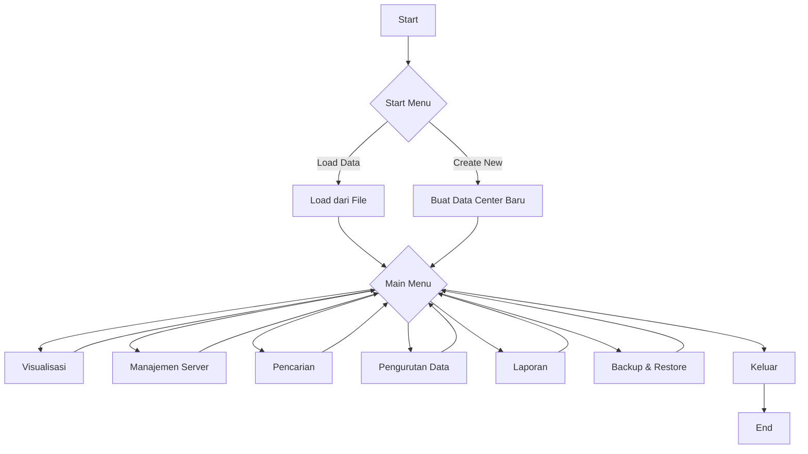
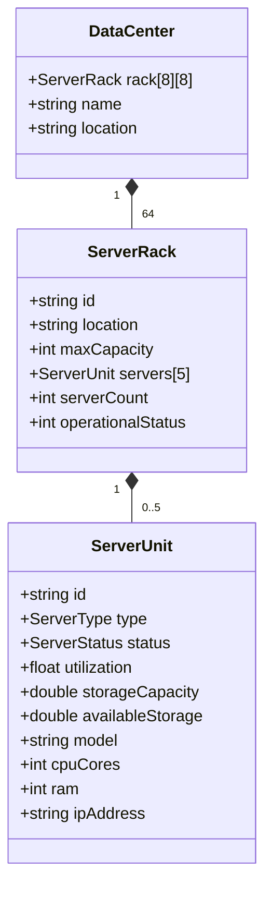

# 🏢 Data Center Management System (DCMS)

<div align="center">


*Sistem Manajemen Data Center Komprehensif dalam C++*

Project Akhir Praktikum Algo Lanjut IF-I

UPN "Veteran" Yogyakarta

**Created by**

Jauza Ilham Mahardhika Putra (123240174)

Prajna Satria Aji Dharma (123240164)

**Important Files To Read**

Structure.md

Fungsi.txt

VersionHistory.md

[🚀 Fitur Utama](#-fitur-utama) • [📖 Dokumentasi](#-struktur-sistem) • [💻 Implementasi Kode](#-implementasi-kode) • [🧪 Demo](#-demo-visualisasi)

</div>

---

## 📋 Daftar Isi

- [🎯 Tentang Proyek](#-tentang-proyek)
- [✨ Fitur Utama](#-fitur-utama)
- [🏗️ Struktur Sistem](#️-struktur-sistem)
- [💻 Implementasi Kode](#-implementasi-kode)
- [🔧 Fungsi-Fungsi Utama](#-fungsi-fungsi-utama)
- [🧪 Demo Visualisasi](#-demo-visualisasi)
- [📊 Algoritma yang Digunakan](#-algoritma-yang-digunakan)
- [🎓 Materi Pembelajaran](#-materi-pembelajaran)
- [📜 Lisensi](#-lisensi)

---

## 🎯 Tentang Proyek

**Data Center Management System (DCMS)** adalah aplikasi berbasis C++ yang dirancang untuk mengelola infrastruktur server dalam pusat data. Sistem ini mengimplementasikan berbagai konsep pemrograman lanjut dalam satu aplikasi terintegrasi.

### 📈 Spesifikasi Teknis
- **Bahasa**: C++ (100%)
- **Layout**: Grid 8x8 dengan sistem walkway
- **Kapasitas**: Maksimal 5 server per rack
- **Storage**: File-based persistence (.txt)
- **Last Update**: 2025-06-02 18:13:58 UTC
- **Repository Owner**: dragonsterm

---

## ✨ Fitur Utama

<div align="center">
<table>
<tr>
<td align="center" width="33%">

### 🗺️ Visualisasi Data Center
Tampilan layout interaktif dengan grid 8x8 dan sistem walkway yang realistis

</td>
<td align="center" width="33%">

### 🔧 Manajemen Server 
Operasi CRUD lengkap dengan validasi input dan interface yang user-friendly

</td>
<td align="center" width="33%">

### 🔍 Pencarian Cerdas
Binary Search untuk pencarian berdasarkan ID dan Available Storage

</td>
</tr>
<tr>
<td align="center" width="33%">

### 📊 Pengurutan Data
Quick Sort dan Insertion Sort dengan multiple criteria

</td>
<td align="center" width="33%">

### 📋 Laporan Otomatis
Generate laporan komprehensif dalam format file terstruktur

</td>
<td align="center" width="33%">

### 💾 Backup & Restore
Sistem penyimpanan data yang aman dengan multiple options

</td>
</tr>
</table>
</div>

---

## 🏗️ Struktur Sistem

### 📦 Data Structures

#### `ServerUnit` - Unit Server Individual
```cpp
struct ServerUnit {
    string id;               // ID unik server
    ServerType type;         // Tipe: Web, Database, Application, File
    ServerStatus status;     // Status: Online, Offline, Maintenance
    float utilization;       // Utilisasi CPU (0-100%)
    double stroageCapacity;  // Kapasitas total storage (GB)
    double availableStorage; // Storage tersedia (GB)
    string model;            // Model server
    int cpuCores;            // Jumlah core CPU
    int ram;                 // RAM dalam GB
    string ipAddress;        // Alamat IP
};
```

#### `ServerRack` - Rack Server
```cpp
struct ServerRack {
    string id;               // ID rack (e.g., "R1-C2")
    string location;         // Lokasi (e.g., "Zone 1")
    int maxCapacity;         // Kapasitas maksimum (default: 5)
    ServerUnit servers[5];   // Array server
    int serverCount;         // Jumlah server saat ini
    int operationalStatus;   // Status operasional rack
};
```

#### `DataCenter` - Struktur Utama
```cpp
struct DataCenter {
    static const int Row = 8;     // Jumlah baris
    static const int Colum = 8;   // Jumlah kolom
    ServerRack rack[Row][Colum];  // Grid rack
    string name;                  // Nama data center
    string location;              // Lokasi data center
};
```

### 🔄 Diagram Alir Sistem



---

## 💻 Implementasi Kode

<details>
<summary><h3>💡 Struct & Enum Dasar</h3></summary>

#### Enum untuk Status dan Tipe Server
```cpp
enum ServerStatus
{
    Offline,
    Online,
    Maintanance,
    UnKnown
};

enum ServerType
{
    Web,
    Database,
    Application,
    File,
    UnCategorized
};
```

#### Constructor ServerUnit
```cpp
// Constructor untuk nilai default
ServerUnit(string id = "", ServerType type = UnCategorized, ServerStatus status = Offline) : 
    id(id),
    type(type),
    status(status),
    utilization(0.0),
    stroageCapacity(100.0),
    availableStorage(100.0),
    model("Generic Server Device"),
    cpuCores(4),
    ram(16),
    ipAddress("1.0.0.1") {}
```

#### Constructor ServerRack
```cpp
// Constructor untuk nilai default
ServerRack() : 
    id(""),
    location(""),
    maxCapacity(5),
    serverCount(0),
    operationalStatus(true) {}
```

#### Constructor DataCenter
```cpp
// Constructor untuk nilai default
DataCenter() : 
    name("Default Data Center"),
    location("Unrecognized Location")
{
    for (int r = 0; r < Row; r++)
    {
        for (int c = 0; c < Colum; c++)
        {
            rack[r][c].id = "R" + to_string(r + 1) + "-C" + to_string(c + 1);
            rack[r][c].location = "Zone " + to_string((r / 2) + 1);
        }
    }
}
```

</details>

<details>
<summary><h3>🚀 Fungsi Main dan Inisialisasi</h3></summary>

#### Fungsi Main
```cpp
int main()
{
    startMenu();
    mainMenu();
    return 0;
}
```
> **Penjelasan**: Titik masuk utama program. Memanggil startMenu() untuk inisialisasi awal dan kemudian mainMenu() untuk interaksi pengguna utama.

#### Fungsi getCurrentDateTime()
```cpp
string getCurrentDateTime()
{
    time_t now = time(0);
    tm *localTime = localtime(&now);

    char temp[80];
    strftime(temp, 80, "%d/%m/%Y %H:%M:%S", localTime);
    return string(temp);
}
```
> **Penjelasan**: Mengambil waktu saat ini dari sistem dan memformatnya menjadi string dengan format tanggal/bulan/tahun jam:menit:detik.

#### Fungsi startMenu()
```cpp
void startMenu()
{
    int choice;
    bool validChoice = false;
    while(!validChoice)
    {
        system("cls");
        cout << "===== DATA CENTER MANAGEMENT SYSTEM =====" << endl;
        cout << "=====  DCMS V 1.0 (released) #2025  =====" << endl;
        cout << "[Current Date & Time: " << getCurrentDateTime() << "]" << endl << endl;
        cout << "+---------------------------------------+" << endl;
        cout << "|             START MENU                |" << endl;
        cout << "+---------------------------------------+" << endl;
        cout << "|  1. Load Data dari File Existing      |" << endl;
        cout << "|  2. Buat Data Center Baru             |" << endl;
        cout << "+---------------------------------------+" << endl;
        
        cout << "\nPilih opsi [1-2]: ";
        cin >> choice;
        
        // Validasi input dan proses pilihan
        // ...
    }
}
```
> **Penjelasan**: Menampilkan menu awal dengan opsi untuk memuat data yang ada atau membuat data center baru. Menggunakan loop untuk validasi input.

</details>

<details>
<summary><h3>🗃️ Operasi File</h3></summary>

#### Fungsi saveDataToFile()
```cpp
void saveDataToFile(string fileName)
{
    ofstream file(fileName);
    if (file.is_open()) 
    {
        // menulis info data center
        file << "DATA_CENTER_INFO" << endl;
        file << dataCenter.name << endl;
        file << dataCenter.location << endl;
        file << "END_DATA_CENTER_INFO" << endl;

        // menulis rack dan server data
        file << "RACK_DATA" << endl;
        for (int r = 0; r < DataCenter::Row; r++) 
        {
            for (int c = 0; c < DataCenter::Colum; c++) 
            {
                file << "RACK " << r << " " << c << endl;
                file << dataCenter.rack[r][c].id << endl;
                file << dataCenter.rack[r][c].location << endl;
                file << dataCenter.rack[r][c].maxCapacity << endl;
                file << dataCenter.rack[r][c].operationalStatus << endl;
                file << dataCenter.rack[r][c].serverCount << endl;
                
                // menulis data server untuk rack
                for (int s = 0; s < dataCenter.rack[r][c].serverCount; s++) 
                {
                    ServerUnit& server = dataCenter.rack[r][c].servers[s];
                    file << "SERVER" << endl;
                    file << server.id << endl;
                    file << (int)server.type << endl;
                    file << (int)server.status << endl;
                    file << server.utilization << endl;
                    file << server.stroageCapacity << endl;
                    file << server.availableStorage << endl;
                    file << server.model << endl;
                    file << server.cpuCores << endl;
                    file << server.ram << endl;
                    file << server.ipAddress << endl;
                    file << "END_SERVER" << endl;
                }
                file << "END_RACK" << endl;
            }
        }
        file << "END_RACK_DATA" << endl;
        
        file.close();
        cout << "Data berhasil disimpan ke file: " << fileName << endl;
    } else 
    {
        cout << "Error: Tidak dapat membuka file untuk penyimpanan" << endl;
    }
}
```
> **Penjelasan**: Menyimpan seluruh struktur data center ke file teks dengan format terstruktur. Menulis informasi data center, rack, dan setiap server beserta detailnya.

#### Fungsi loadDataFromFile()
```cpp
void loadDataFromFile(string fileName)
{
    ifstream file(fileName);
    if (file.is_open())
    {
        string line;

        // mambaca info data center
        while (getline(file, line))
        {
            if (line == "DATA_CENTER_INFO")
            {
                getline(file, dataCenter.name);
                getline(file, dataCenter.location);
                getline(file, line);
                break;
            }
        }

        // membaca data untuk Rack
        while (getline(file, line))
        {
            if (line == "RACK_DATA")
            {
                while (getline(file, line))
                {
                    if (line == "END_RACK_DATA") break;
                    if (line.substr(0, 4) == "RACK")
                    {
                        int r;
                        int c;
                        sscanf(line.c_str(), "RACK %d %d", &r, &c);
                        
                        // Baca data rack
                        // ...
                        
                        // Baca data server
                        // ...
                    }
                }
                break;
            }
        }
        file.close();
    } else
    {
        cout << "Error: Tidak dapat membuka file: " << fileName << endl;
    }
}
```
> **Penjelasan**: Membaca data dari file teks dan mengisi struktur data center. Memproses file baris demi baris untuk mendapatkan informasi data center, rack, dan server.

</details>

<details>
<summary><h3>🖥️ Manajemen Server</h3></summary>

#### Fungsi addServer()
```cpp
bool addServer(ServerRack& rack, const ServerUnit& server)
{
    if (rack.serverCount < 5)
    {
        rack.servers[rack.serverCount] = server; // Menambahkan server ke dalam array
        rack.serverCount++;
        return true;
    }
    return false; // rack penuh
}
```
> **Penjelasan**: Menambahkan server baru ke rack jika belum penuh. Fungsi ini digunakan oleh fungsi manajemen yang lebih tinggi.

#### Fungsi removeServer()
```cpp
bool removeServer(ServerRack& rack, int index)
{
    if (index >= 0 && index < rack.serverCount)
    {
        for (int i = index; i < rack.serverCount - 1; i++)
        {
            rack.servers[i] = rack.servers[i + 1];
        }
        rack.serverCount--;
        return true;
    }
    return false;
}
```
> **Penjelasan**: Menghapus server dari rack berdasarkan indeks dan menggeser server lain untuk mengisi gap.

#### Fungsi addNewServer() (Partial)
```cpp
void addNewServer()
{
    system("cls");
    cout << "\n===== Tambah Server Baru =====" << endl;
    displaySimpleDataCenterMap();

    int row;
    int colum;
    bool validLocation = false;
    while (!validLocation)
    {
        cout << "\nMasukkan lokasi untuk server baru:" << endl;
        cout << "Baris [1-" << DataCenter::Row << "]: ";
        cin >> row;
        cout << "Kolom [1-" << DataCenter::Colum << "]: ";
        cin >> colum;

        // Validasi input dan lokasi
        // ...
        
        if (!validateServerPlacement(row, colum))
        {
            // Tampilkan pesan error sesuai masalah
            // ...
            continue;
        }
        validLocation = true;
    }
    
    // Proses penambahan server ke rack yang dipilih
    // ...
}
```
> **Penjelasan**: Interface interaktif untuk menambahkan server baru. Memandu pengguna melalui proses pemilihan lokasi rack, validasi, dan input informasi server.

#### Fungsi displayServerInputForm()
```cpp
void displayServerInputForm(ServerUnit& server)
{
    int typeChoice;
    int statusChoice;
    system("cls");
    cout << "\n===== Input Data Server =====" << endl;
    cout << "| Masukkan ID Server: ";
    cin.ignore();
    getline(cin, server.id);
    
    // Form untuk tipe server
    system("cls");
    cout << "\n===== Input Data Server =====" << endl;
    cout << "| Server ID: " << server.id << endl;
    cout << "| Pilih Tipe Server:" << endl;
    cout << "| 1. Web Server" << endl;
    cout << "| 2. Database Server" << endl;
    cout << "| 3. Application Server" << endl;
    cout << "| 4. File Server" << endl;
    cout << "Pilih [1-4]: ";
    cin >> typeChoice;
    
    // Set tipe server berdasarkan pilihan
    // ...
    
    // Form untuk status server
    // ...
    
    // Form untuk spesifikasi server
    system("cls");
    cout << "\n===== Input Data Server =====" << endl;
    cout << "| Server ID: " << server.id << endl;
    cout << "| Tipe: " << (server.type == Web ? "Web" : server.type == Database ? "Database" :  server.type == File ? "File" : "UnCategorized") << endl;
    cout << "| Status: " << (server.status == Online ? "Online" : server.status == Offline ? "Offline" : server.status == Maintanance ? "Maintenance" : "Unknown") << endl;
    cout << "============================" << endl;
    cout << "| Masukkan Utilisasi (0-100%): ";
    cin >> server.utilization;
    cout << "| Masukkan Kapasitas Storage (GB): ";
    cin >> server.stroageCapacity;
    
    // Input spesifikasi lainnya
    // ...
}
```
> **Penjelasan**: Form interaktif untuk mengisi semua informasi server baru. Membimbing pengguna melalui setiap langkah proses input dengan validasi dan tampilan yang jelas.

</details>

<details>
<summary><h3>🔍 Pencarian dan Pengurutan</h3></summary>

#### Fungsi findServerById()
```cpp
void findServerById()
{
    system("cls");
    cout << "\n===== Pencarian =====" << endl;
    cout << "Metode Searching: Binary Search" << endl;
    cout << "Mencari server berdasarkan ID" <<endl;
    cout << "============================" << endl;
    ServerUnit allServers[320];
    string rackInfo[320];
    int totalCount = 0;
    collectAllServersWithRackInfo(allServers, rackInfo, totalCount);
    
    if (totalCount == 0)
    {
        cout << "Tidak ada server dalam data center" << endl;
        cout << "Tekan Enter untuk kembali...";
        cin.ignore();
        cin.get();
        return;
    }
    
    string targetId;
    cout << "Total server dalam data center: " << totalCount << endl;
    cout << "\nMasukkan Server ID yang dicari: ";
    cin.ignore();
    getline(cin, targetId);
    
    // Konversi ID ke uppercase untuk konsistensi
    for (int i = 0; i < targetId.length(); i++)
    {
        targetId[i] = toupper(targetId[i]);
    }
    
    // Urutkan server berdasarkan ID (bubble sort digunakan disini)
    // ...
    
    // Binary search untuk menemukan server
    int left = 0;
    int right = totalCount - 1;
    int result = -1;
    while (left <= right)
    {
        int mid = left + (right - left) / 2;
        string currentId = allServers[mid].id;
        for (int i = 0; i < currentId.length(); i++)
        {
            currentId[i] = toupper(currentId[i]);
        }
        
        if (currentId == targetId)
        {
            result = mid;
            break;
        }
        else if (currentId < targetId)
        {
            left = mid + 1;
        }
        else
        {
            right = mid - 1;
        }
    }
    
    // Tampilkan hasil pencarian
    // ...
}
```
> **Penjelasan**: Implementasi Binary Search untuk mencari server berdasarkan ID. Mengumpulkan semua server, mengurutkannya, dan menggunakan algoritma binary search untuk pencarian efisien.

#### Fungsi quickSortServersDescending()
```cpp
void quickSortServersDescending(ServerUnit servers[], int low, int high, int sortBy)
{
    if (low < high) 
    {
        int pivotIndex = partitionForQuickSort(servers, low, high, sortBy);
        quickSortServersDescending(servers, low, pivotIndex - 1, sortBy);
        quickSortServersDescending(servers, pivotIndex + 1, high, sortBy);
    }
}
```
> **Penjelasan**: Implementasi algoritma Quick Sort untuk mengurutkan server secara descending berdasarkan kriteria tertentu. Menggunakan pendekatan divide-and-conquer dengan partisi dan rekursi.

#### Fungsi partitionForQuickSort()
```cpp
int partitionForQuickSort(ServerUnit servers[], int low, int high, int sortBy)
{
    float pivot;
    switch (sortBy)
    {
        case 1:
            pivot = servers[high].utilization;
            break;
        case 2:
            pivot = (float)servers[high].availableStorage;
            break;
        case 3:
            pivot = (float)servers[high].stroageCapacity;
            break;
        case 4:
            pivot = (float)servers[high].cpuCores;
            break;
        case 5:
            pivot = (float)servers[high].ram;
            break;
        default:
            cout << "Invalid sort option!" << endl;
            break;    
    }
    
    int i = low - 1;
    for (int j = low; j <= high - 1; j++)
    {
        float currentValue;
        // Get current value based on sort criteria
        // ...
        
        if (currentValue > pivot) // untuk descending
        {
            i++;
            swapServers(&servers[i], &servers[j]);
        }
    }
    swapServers(&servers[i + 1], &servers[high]);
    return(i + 1);
}
```
> **Penjelasan**: Fungsi partisi untuk algoritma Quick Sort. Memilih pivot dan mengelompokkan elemen yang lebih besar di kiri dan yang lebih kecil di kanan (untuk pengurutan descending).

#### Fungsi insertionSortServersAscending()
```cpp
void insertionSortServersAscending(ServerUnit servers[], int size, int sortBy)
{
    cout << "\n===== Proses Sorting (Ascending - Insertion Sort) =====" << endl;
    cout << "Berdasarkan: ";
    // Show sorting criteria
    // ...

    for (int i = 1; i < size; i++)
    {
        ServerUnit key = servers[i];
        int j = i - 1;

        // Debug: tampilkan info server yang sedang disisipkan
        cout << "\nMenyisipkan server: " << key.id << endl;

        while (j >= 0)
        {
            bool shouldSwap = false;
            // Determine if swap is needed based on sort criteria
            // ...

            if (!shouldSwap)
            {
                servers[j + 1] = servers[j];
                j--;
            }
            else
            {
                break;
            }
        }
        servers[j + 1] = key;
    }
}
```
> **Penjelasan**: Implementasi algoritma Insertion Sort untuk mengurutkan server secara ascending. Iterasi melalui array dan menempatkan setiap elemen pada posisi yang tepat di bagian terurut dari array.

</details>

<details>
<summary><h3>📊 Visualisasi Data Center</h3></summary>

#### Fungsi displayDataCenterMap()
```cpp
void displayDataCenterMap()
{
    int choice;
    bool exit = false;

    do
    {
        system("cls");
        cout << "\n=== Visualisasi Data Center ===" << endl;
        cout << "Nama Data Center: [" << dataCenter.name << "]" << endl;
        cout << "Lokasi: [" << dataCenter.location << "]" << endl;

        // Colum Header
        cout << "{0} ";
        for (int c = 0; c < DataCenter::Colum; c++)
        {
            if (c == 2 || c == 5)
            {
                cout << "{W}";
            }
            else
            {
                cout << "{" << c + 1 << "}";
            }
        }
        cout << endl;
        
        // Data Center Layout
        for (int r = 0; r < DataCenter::Row; r++)
        {
            // Walkway Row
            if (r == 2 || r == 5)
            {
                cout << "{W}" << endl;
                continue;
            }

            // Print nomer Row
            cout << "{" << r + 1 << "} ";

            // Server Rack di dalam setiap Row
            for (int c = 0; c < DataCenter::Colum; c++)
            {
                // Walkway space
                if (c == 2 || c == 5)
                {
                    cout << "   ";
                    continue;
                }

                int serverCount = dataCenter.rack[r][c].serverCount;

                // Display Rack
                if (serverCount > 0)
                {
                    cout << "[" << serverCount << "]";
                }
                else
                {
                    cout << "[ ]";
                }
            }
            cout << endl;
        }
        
        // Statistik dan menu selanjutnya
        // ...
    } while (!exit);
}
```
> **Penjelasan**: Menampilkan visualisasi grid data center dengan layout 8x8 termasuk walkway pada baris dan kolom 3 & 6. Menunjukkan jumlah server di setiap rack dengan notasi [n].

#### Fungsi displayRackView()
```cpp
void displayRackView()
{
    int row, column;
    bool ValidCoords = false;
    
    // Pemilihan rack untuk dilihat secara detail
    while (!ValidCoords) {
        system("cls");
        cout << "\n===== Tampilan Server Rack =====" << endl;
        cout << "\nReferensi Peta Data Center:" << endl;
        
        // Tampilkan peta data center
        // ...
        
        // Input koordinat rack
        cout << "\n------------------------------------------\n";
        cout << "\n=== Tampilan Server Rack ===" << endl;
        cout << "Masukkan koordinat Rack (Baris,Kolom):\n";
        cout << "[1-" << DataCenter::Row << "]: ";
        cin >> row;
        cout << "[1-" << DataCenter::Colum << "]: ";
        cin >> column;
        
        // Validasi koordinat
        // ...
        
        ValidCoords = true; 
    }

    bool exit = false;
    while (!exit) {
        // Ambil informasi rack
        ServerRack &rack = dataCenter.rack[row][column];
        
        // Tampilkan detail rack
        system("cls");
        cout << "\n===== Detail Rack Server =====" << endl;
        cout << "ID Rack: " << rack.id << endl;
        cout << "Lokasi: " << rack.location << endl;
        cout << "Kapasitas: " << rack.maxCapacity << " Server" << endl;
        cout << "Status Operasional: " << (rack.operationalStatus ? "Aktif" : "Tidak Aktif") << endl;
        
        // Tampilkan daftar server dalam rack jika ada
        // ...
    }
}
```
> **Penjelasan**: Memungkinkan pengguna memilih dan melihat detail rack tertentu. Menampilkan informasi rack dan daftar server di dalamnya dalam format tabel yang mudah dibaca.

#### Fungsi displayServerDetails()
```cpp
void displayServerDetails(ServerRack& rack)
{
    int serverIndex;
    system("cls");
    cout << "\n===== Detail Server =====" << endl;
    cout << "\nServer dalam Rack " << rack.id << ":" << endl;
    
    // Tampilkan daftar server untuk dipilih
    cout << "+-------+------------+" << endl;
    cout << "| No.   | Server ID  |" << endl;
    cout << "+-------+------------+" << endl;
    for (int i = 0; i < rack.serverCount; i++)
    {
        cout << "| " << setw(5) << left << i + 1 << " | "
             << setw(10) << left << rack.servers[i].id << " |" << endl;
    }
    cout << "+-------+------------+" << endl;
    
    // Pilih server untuk dilihat detailnya
    cout << "Masukkan nomor server [1-" << rack.serverCount << "]: ";
    cin >> serverIndex;
    
    // Validasi input
    // ...
    
    // Tampilkan detail server yang dipilih
    system("cls");
    cout << "\n===== Detail Server =====" << endl;
    cout << "Dalam Rack: " << rack.id << " (Server " << serverIndex + 1 << " dari " << rack.serverCount << ")" << endl;
    cout << "\n=== Informasi Umum ===" << endl;
    cout << "| ID Server              : " << server.id << endl;
    cout << "| Model                  : " << server.model << endl;
    cout << "| Tipe                   : " << typeString << endl;
    cout << "| Status                 : " << statusString << endl;
    cout << "| IP Address             : " << server.ipAddress << endl;
    cout << "---spesifikasi Server---" << endl;
    cout << "| CPU Cores              : " << server.cpuCores << endl;
    cout << "| RAM                    : " << server.ram << " GB" << endl;
    cout << "| Kapasitas Penyimpanan  : " << server.stroageCapacity << " GB" << endl;
    cout << "| Penyimpanan Tersedia   : " << server.availableStorage << " GB" << endl;
    cout << "| Utilisasi              : " << server.utilization << " %" << endl;
}
```
> **Penjelasan**: Menampilkan informasi detail tentang server tertentu dalam rack. Pengguna dapat memilih server dan melihat semua atributnya dalam format yang terorganisir dengan baik.

</details>

<details>
<summary><h3>📝 Laporan dan Backup</h3></summary>

#### Fungsi generateReports()
```cpp
void generateReports()
{
    system("cls");
    cout << "\n===== Laporan =====" << endl;
    string fileName;
    cout << "Masukkan nama file laporan (tanpa ekstensi .txt): ";
    cin.ignore();
    getline(cin, fileName);
    fileName += "_report.txt";
    
    ofstream reportFile(fileName);
    if (!reportFile.is_open())
    {
        cout << "Error: Tidak dapat membuat file laporan!" << endl;
        cout << "Tekan Enter untuk kembali...";
        cin.get();
        return;
    }
    
    // Header untuk Laporan
    reportFile << "===============================================" << endl;
    reportFile << "         DATA CENTER MANAGEMENT REPORT        " << endl;
    reportFile << "===============================================" << endl;
    reportFile << "Report Generated: " << getCurrentDateTime() << endl;
    reportFile << "===============================================" << endl << endl;
    
    // Tulis informasi data center
    reportFile << "=== DATA CENTER INFORMATION ===" << endl; 
    reportFile << "Name: " << dataCenter.name << endl;
    reportFile << "Location: " << dataCenter.location << endl;
    reportFile << "Total Racks Available: " << (DataCenter::Row * DataCenter::Colum) - 16 << " racks" << endl;
    reportFile << endl;
    
    // Hitung dan tulis statistik server
    // ...
    
    // Tulis detail rack dan server
    // ...
    
    reportFile.close();
    
    // Tampilkan konfirmasi
    system("cls");
    cout << "\n===== Laporan =====" << endl;
    cout << "Laporan berhasil dibuat!" << endl;
    cout << "File: " << fileName << endl;
    cout << "Total Servers: " << totalServers << endl;
    cout << "Active Servers: " << activeServers << "/" << totalServers << endl;
    cout << "Racks with Servers: " << racksWithServers << endl;
}
```
> **Penjelasan**: Membuat laporan komprehensif tentang data center dalam format file teks. Laporan mencakup informasi data center, statistik server, dan detail setiap rack dan server.

#### Fungsi backupAndRestore()
```cpp
void backupAndRestore()
{
    int choice;
    bool exit = false;
    do 
    {
        system("cls");
        cout << "\n===== Backup & Restore Data =====" << endl;
        cout << "1. Save Data ke File (Replace Current)" << endl;
        cout << "2. Backup Data ke File (Create Copy)" << endl;
        cout << "3. Restore Data dari File" << endl;
        cout << "4. Kembali ke Menu Utama" << endl;
        cout << "Pilih opsi [1-4]: ";
        cin >> choice;
        
        // Validasi input dan proses pilihan
        switch (choice) {
        case 1:
            {
                // Save data (replace current file)
                // ...
            }
            break;
        case 2:
            {
                // Backup data (create new file)
                // ...
            }
            break;
        case 3:
            {
                // Restore data from file
                // ...
            }
            break;
        case 4:
            exit = true;
            break;
        default:
            // Handle invalid choice
            // ...
            break;
        }
    } while (!exit);
}
```
> **Penjelasan**: Menyediakan menu untuk operasi backup dan restore data. Memungkinkan pengguna untuk menyimpan data ke file saat ini, membuat backup baru, atau memulihkan data dari file yang ada.

</details>

---

## 🔧 Fungsi-Fungsi Utama

<details>
<summary><h3>Manajemen Data Center</h3></summary>

#### `createNewDataCenter()`
> **Fungsi**: Membuat data center baru dengan layout default 8x8
>
> **Penjelasan Singkat**: Pengguna dapat memilih antara data center kosong atau sample data. Sistem akan menginisialisasi rack dengan ID dan lokasi otomatis berdasarkan koordinat, serta membuat walkway pada baris dan kolom 3 & 6.

```cpp
void createNewDataCenter() {
    // Pilihan: Default (dengan sample data) atau Manual (zero data)
    // Pengaturan nama dan lokasi data center
    // Inisialisasi rack dengan ID dan lokasi otomatis
    // Simpan konfigurasi ke file
}
```

#### `displayDataCenterMap()`
> **Fungsi**: Menampilkan visualisasi grid data center
>
> **Penjelasan Singkat**: Menampilkan representasi visual dari data center dengan format grid 8x8, menunjukkan jumlah server di setiap rack dan walkway/koridor.

```cpp
void displayDataCenterMap() {
    // Tampilkan header kolom (1-8) dengan walkway
    // Tampilkan setiap baris dengan jumlah server dalam rack
    // Tampilkan statistik total rack dan server
}
```

</details>

<details>
<summary><h3>Manajemen Server</h3></summary>

#### `addNewServer()`
> **Fungsi**: Menambahkan server baru ke rack
>
> **Penjelasan Singkat**: Proses pemilihan lokasi rack, validasi (bukan walkway, rack tidak penuh), dan input data server baru dengan form komprehensif.

```cpp
void addNewServer() {
    // Pilih lokasi rack (baris, kolom)
    // Validasi lokasi (bukan walkway, rack tidak penuh)
    // Tampilkan form input untuk informasi server
    // Tambahkan server ke rack
}
```

#### `updateServerStatus()`
> **Fungsi**: Memperbarui status server (Online, Offline, Maintenance)
>
> **Penjelasan Singkat**: Memungkinkan pengguna mengubah status operasional server untuk monitoring dan maintenance.

```cpp
void updateServerStatus() {
    // Pilih lokasi rack
    // Pilih server dalam rack
    // Pilih status baru
    // Update status server
}
```

</details>

<details>
<summary><h3>Pencarian dan Pengurutan</h3></summary>

#### `findServerById()` 
> **Fungsi**: Mencari server berdasarkan ID dengan Binary Search
>
> **Penjelasan Singkat**: Menggunakan algoritma Binary Search untuk menemukan server dengan ID tertentu secara efisien dalam kumpulan server yang telah diurutkan.

```cpp
void findServerById() {
    // Kumpulkan semua server dalam array
    // Urutkan server berdasarkan ID
    // Gunakan binary search untuk menemukan server
    // Tampilkan detail server jika ditemukan
}
```

#### `quickSortServersDescending(ServerUnit servers[], int low, int high, int sortBy)`
> **Fungsi**: Implementasi Quick Sort untuk mengurutkan server secara descending
>
> **Penjelasan Singkat**: Algoritma Quick Sort untuk mengurutkan server berdasarkan kriteria tertentu (utilisasi, storage, CPU cores, dsb).

```cpp
void quickSortServersDescending(ServerUnit servers[], int low, int high, int sortBy) {
    // Implementasi algoritma quick sort
    // Partisi array dan recursive sorting
}
```

</details>

<details>
<summary><h3>Laporan dan Backup</h3></summary>

#### `generateReports()`
> **Fungsi**: Membuat laporan komprehensif tentang data center
>
> **Penjelasan Singkat**: Menghasilkan laporan detail dalam format file teks, mencakup statistik server, informasi rack, dan status keseluruhan data center.

```cpp
void generateReports() {
    // Buat file laporan baru
    // Tulis header dan informasi data center
    // Hitung dan tulis statistik server
    // Tulis detail setiap rack dan server
}
```

#### `backupAndRestore()`
> **Fungsi**: Menu untuk backup dan restore data
>
> **Penjelasan Singkat**: Menyediakan opsi untuk menyimpan, mencadangkan, dan memulihkan data dari file, memastikan data dapat direkam dan dipulihkan jika diperlukan.

```cpp
void backupAndRestore() {
    // Opsi Save (menimpa file saat ini)
    // Opsi Backup (membuat salinan)
    // Opsi Restore (memulihkan dari file)
}
```

</details>

---

## 🧪 Demo Visualisasi

### 📊 Layout Data Center
```
{0} {1}{2}{W}{4}{5}{W}{7}{8}
{1} [ ][ ]   [ ][ ]   [ ][ ]
{2} [ ][ ]   [1][ ]   [ ][ ]
{W}
{4} [ ][ ]   [ ][ ]   [ ][ ]
{5} [ ][ ]   [ ][ ]   [ ][ ]
{W}
{7} [1][ ]   [1][ ]   [ ][ ]
{8} [ ][ ]   [ ][ ]   [ ][ ]
```

### 📈 Tampilan Server dalam Rack
```
===== Detail Rack Server =====
ID Rack: R7-C1
Lokasi: Zone 4
Kapasitas: 5 Server
Status Operasional: Aktif

===== Daftar Server dalam Rack =====
+-------+------------+--------------+-----------+---------------+----------------+
| No.   | Server ID  | Tipe         | Status    | Utilisasi (%) | Storage (GB)   |
+-------+------------+--------------+-----------+---------------+----------------+
| 1     | DB-002     | Database     | Online    | 0             | 100/100        |
+-------+------------+--------------+-----------+---------------+----------------+
```

### 📋 Contoh Hasil Pencarian
```
===== Hasil Pencarian Server ID =====
Server dengan ID "WEB-001" ditemukan!
============================
| Server ID              : WEB-001
| Rack Location          : R1-C1
| Model                  : Generic Server Device
| Type                   : Web
| Status                 : Online
| IP Address             : 1.0.0.1
============================
| CPU Cores              : 4
| RAM                    : 16 GB
| Total Storage          : 100 GB
| Available Storage      : 100 GB
| Utilization            : 0%
============================
```

---

## 📊 Algoritma yang Digunakan

<div align="center">
<table>
<tr>
<th>Algoritma</th>
<th>Implementasi</th>
<th>Kompleksitas</th>
<th>Keterangan</th>
</tr>
<tr>
<td align="center">Binary Search</td>
<td>Pencarian server berdasarkan ID & Storage</td>
<td align="center">O(log n)</td>
<td>Metode pencarian efisien untuk data terurut</td>
</tr>
<tr>
<td align="center">Quick Sort</td>
<td>Pengurutan server secara descending</td>
<td align="center">O(n log n)</td>
<td>Algoritma divide and conquer untuk pengurutan cepat</td>
</tr>
<tr>
<td align="center">Insertion Sort</td>
<td>Pengurutan server secara ascending</td>
<td align="center">O(n²)</td>
<td>Efisien untuk dataset kecil atau hampir terurut</td>
</tr>
</table>
</div>

---

## 🎓 Materi Pembelajaran

### Implementasi Struktur Data
- **Struct & Enum**: Penggunaan advanced struct dengan nested components
- **Array 2D**: Grid layout untuk representasi data center

### Algoritma Pencarian & Pengurutan
- **Binary Search**: Implementasi untuk pencarian efisien
- **Quick Sort & Insertion Sort**: Perbandingan algoritma pengurutan dengan kompleksitas berbeda

### Konsep Pemrograman Lanjut
- **File Handling**: Operasi baca/tulis untuk persistensi data
- **Validasi Input**: Defensive programming untuk mencegah input invalid
- **CRUD Operations**: Implementasi operasi Create, Read, Update, Delete

<div align="center">
  <h2>⭐ Diagram Implementasi ⭐</h2>



</div>

---

## 📜 Lisensi

Data Center Management System (DCMS) Custom License

Copyright (c) 2025 Jauza Ilham Mahardhika Putra and Prajna Satria Aji Dharma

Permission is hereby granted, free of charge, to any person obtaining a copy
of this software and associated documentation files (the "Software"), to deal
in the Software without restriction for non-commercial purposes, including 
without limitation the rights to use, copy, modify, merge, publish, distribute, 
and/or sublicense the Software, subject to the following conditions:

NON-COMMERCIAL USE ONLY:
The Software may be used, copied, modified, merged, published, distributed, 
and/or sublicensed for non-commercial purposes only. Any commercial use, 
including but not limited to selling, licensing for profit, or incorporating 
into commercial products or services, is strictly prohibited without prior 
written permission from the copyright holders.

ACADEMIC AND EDUCATIONAL USE:
This Software is specifically designed for educational and academic purposes.
Students, researchers, and educational institutions are encouraged to use,
study, and modify this Software for learning and research purposes.

For full license terms, please see the LICENSE file in the repository.

---

<div align="center">
  <b>© 2025 Data Center Management System</b><br>
  <i>Project Akhir Praktikum Algoritma Lanjut - v1.0</i>
  <p>Last Updated: 2025-06-02 18:13:58</p>
</div>